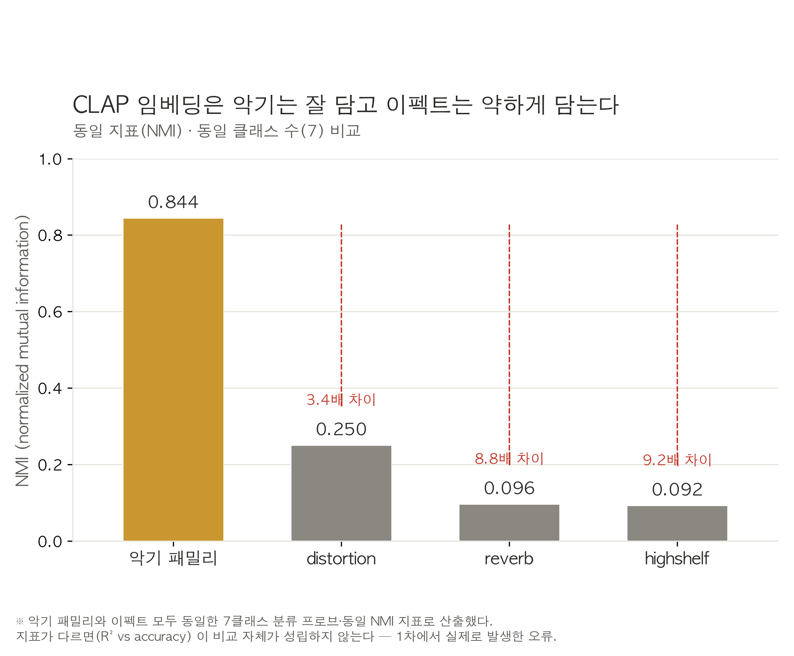
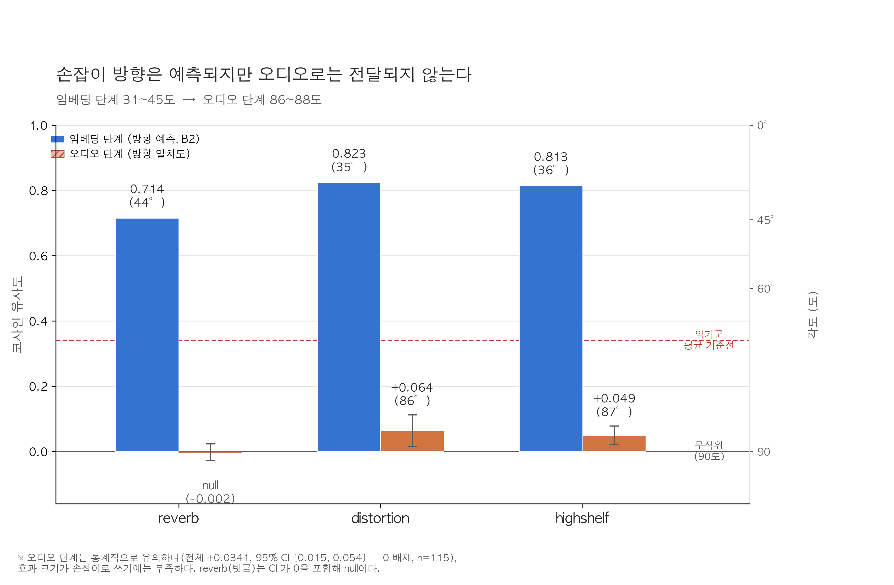

# CLAP FX Probe

> 원본 TokenSynth 논문(ICASSP 2025) 코드는 [`tokensynth_paper/`](tokensynth_paper/) 폴더로 옮겼습니다 —
> 사용법은 [`tokensynth_paper/README.md`](tokensynth_paper/README.md), 논문 요약은
> [`tokensynth_paper/PAPER_SUMMARY.md`](tokensynth_paper/PAPER_SUMMARY.md) 참고. 이 문서는 현재
> 진행 중인 실험(아래)만 다룹니다.

TokenSynth 논문은 오디오 이펙트(EQ·디스토션·리버브)로 augmentation한 `TokenSynth-Aug`가
이펙트 걸린(wet) 오디오 복제에서 오히려 dry로만 학습한 기본 모델보다 못한 현상을 관찰하고,
그 원인을 "CLAP 임베딩이 오디오 이펙트 정보를 결여했기 때문으로 보인다"고 추정만 했다.
이 하위 프로젝트는 그 추정을 재학습 없이 직접 측정한다.

## 보고서용 핵심 그림

두 그림 모두 기존 `out/results/*.json`에서 읽은 값만 쓴다 (재계산 없음, 생성:
`23_report_figures.py`).



**그림 1.** 악기 패밀리와 세 이펙트를 동일한 7클래스 분류 프로브·동일 NMI 지표로 비교했다
(출처: `out/results/results_2.json` — `controls.instrument_family_7class_subsampled.nmi`,
`effects.*.probe_nmi`). CLAP 임베딩은 악기 정체성(NMI 0.844)은 강하게 인코딩하지만
이펙트 정보는 그보다 3.4~9.2배 약하게만 담는다 — distortion이 상대적으로 가장 잘
읽히고(0.250), reverb·highshelf는 거의 바닥 수준이다(0.096, 0.092). 지표를 통일하지
않고 R²(회귀)와 accuracy(분류)를 섞어 비교하면 이 결론 자체가 성립하지 않는다는 점이
1차의 실제 오류였다.



**그림 2 — 이 연구의 결론.** 소스 임베딩만으로 손잡이 방향을 예측하면 코사인
0.71~0.82(31~45도)로 상당히 정확하다(출처: `out/results/results_8.json` —
`reverse_b2.*.mlp.cos_mean`). 그러나 그 예측 방향으로 임베딩을 이동시켜 실제 오디오를
생성한 뒤 방향 일치도를 재면 코사인 −0.003~0.064(86~88도)로 무작위(90도)에 가깝게
무너진다(출처: `out/results/results_9_phase_f4.json` —
`directional_agreement.by_effect`, n=115). distortion·highshelf는 통계적으로
유의한 양의 신호가 있지만(95% CI가 0을 배제) reverb는 CI가 0을 포함해 null이다. 즉
**정보가 없는 것이 아니라, 예측까지는 되는데 TokenSynth를 통과하면서 거의 다
소거된다** — "유의하지만 손잡이로 쓰기엔 부족하다"가 이 프로젝트 전체의 결론이다.

### 3차 개정 — 왜 "한 번에 하나씩(OAT)"을 버렸는가

reverb의 파라미터는 서로 독립이 아니다. `wet_level`이 다른 모든 파라미터의 **곱셈
게이트**다 — `wet_level=0`이면 `room_size`/`damping`/`width`가 무엇이든 출력은 dry다.
1·2차처럼 OAT(한 번에 하나씩 스윕)로 `damping`을 재려면 `wet_level`을 어딘가 고정해야
하는데, 그 고정값에 따라 "damping 효과"가 완전히 달라진다 — 게이트가 닫혀 있으면 거의
0, 열려 있으면 크게 나온다. 어느 지점을 볼지가 임의 선택이 되어 "CLAP이 damping을
읽는다"는 진술 자체가 정의되지 않는다. 격자 탐색(7^5=16,807 조합/소스)도 비용상
불가능하다.

그래서 파라미터 공간을 **결합(joint) Latin Hypercube 샘플링**하고, 미분 가능한
**대리모델(residual MLP)**을 학습한 뒤 그 **야코비안 J = ∂e'/∂θ**를 분석하는 방식으로
바꿨다. 비용은 OAT와 비슷한데 파라미터 간 상호작용까지 잡힌다.

### 4차 개정 — 임베딩 재추출 없이 분석만 다시

**3차 임베딩(`out/embeddings.npz`)을 그대로 재사용한다. `01_embed.py`는 이번에 실행하지
않았다.** 아래 7개 과제는 모두 이미 있는 임베딩으로 답할 수 있는 질문들이었다.

1. **H1~H5 위계 폐기 → 입력 마스킹 ablation.** 3차 H3(θ만, 0.650)가 H2(0.974)보다 낮게
   나와 포함 관계(H2⊂H3)가 깨졌다 — 구현 오류였다. 근본 원인: H3(J=J(θ), e_dry 무관)와
   H4(J=J(e_dry), θ 무관)는 애초에 서로를 포함하지 않는 **다이아몬드** 구조였다("사다리"가
   아니었다). `M0`/`M_th`/`M_e`/`M_the` 네 변형(입력 슬롯을 0으로 마스킹, residual
   파라미터화는 유지)으로 대체하고 분산 분해(`d_th`, `d_e`, `d_int`)를 낸다.
2. **★최우선 — NSynth 품질 태그 층화.** "dry" 소스가 사실은 이미 상업 샘플 라이브러리의
   룸 리버브·EQ·컴프레션을 포함하고 있을 수 있다("포화 가설"). `examples.json`의
   `qualities` 필드를 읽어 태그 유무로 층화해 R²를 비교한다(`08_quality_stratified.py`,
   신규 스크립트).
3. **텍스트 정렬 신뢰구간.** 3차 정렬도 수치에 CI가 없었다. 텍스트 쌍 복원추출
   부트스트랩으로 자기 정렬·통제·격차(자기−통제)의 CI를 내고, highshelf의 "bright" 역전이
   유의한지 확인한다.
4. **부분공간 투영 무작위 기준선.** 3차 관측값(0.004~0.008)이 이론적 기댓값
   sqrt(9/512)≈0.133보다 20배 이상 작아 정규화 오류 가능성이 제기됐다. 무작위 단위벡터
   1000개를 같은 부분공간에 투영해 기준선을 만들고 실제값과 비교한다.
5. **게이트 분석 원시 점화.** 3차는 wet_level을 25구간으로 나눠 실효 표본이 25개
   수준이었다(damping p=0.07, 비유의). 테스트셋의 모든 (e_dry, θ) 원시 점을 그대로 써서
   표본을 수천 개로 늘린다.
6. **단사성 지표 정의 점검.** `collision_rate=0.018`(threshold=0.99)과
   `nn_cosine_median=0.9953`(threshold보다 높음)이 모순처럼 보였다 — 정의를 명확히 하고
   같은 소스/다른 소스 최근접 이웃을 분리해 재보고한다.
7. **해상도 바닥 명시.** width(음성 통제, R²=0.0087)와 damping(0.0099)/q(0.0142)/
   cutoff(0.0039)가 통계적으로 구분되지 않았다 — 즉 R²<0.02가 이 실험의 측정 한계다.
   `resolution_floor`를 명시적으로 계산해 그 아래는 "약함"이 아니라 "측정 불가"로 표기한다.

각 과제의 실제 관측값과 판정은 아래 "결과 해석 기준"에 있다.

### 파이프라인 (8단계)

```
01_embed.py               결합 LHS 샘플링 + CLAP 오디오/텍스트 임베딩 추출 (4차는 재실행 안 함)
      │
02_surrogate.py            residual MLP 대리모델 학습 + 입력 마스킹 ablation(M0/M_th/M_e/M_the)
      │
      ├── 03_jacobian.py            야코비안 분석 (게이트 구조, 악기 패밀리별 손잡이) ★핵심
      ├── 04_probe.py               다변량 프로브 + width 음성 통제 + 해상도 바닥 + 악기 패밀리 NMI 통제
      ├── 05_text_alignment.py      텍스트-오디오 방향 정렬 검증 + 부트스트랩 CI
      ├── 06_reverse.py             역방향 사상 + cycle consistency + 단사성 진단(정의 명확화)
      ├── 07_subspace.py            (부차) 악기 판별 부분공간 투영 + 무작위 기준선
      └── 08_quality_stratified.py  ★최우선 — NSynth 품질 태그 층화(포화 가설 검증)
```

`03`~`08`은 `02`가 저장한 `surrogate_model.pt`(`08`은 `embeddings.npz`만)를 재사용하며
서로 독립적으로 실행 가능하다(순서 무관, 전부 `results.json`에 이어 붙임). `01`, `02`는
반드시 먼저 실행해야 한다.

### 설치

```bash
pip install -e "./tokensynth_paper[probe]"
```

TokenSynth 패키지 정의(`pyproject.toml`)가 `tokensynth_paper/`로 옮겨졌으므로 저장소 루트에서
위 경로로 설치합니다.

> **알려진 문제**: pip가 `torchaudio`를 `torch`와 호환되지 않는 버전(예: torch 2.5.1 +
> torchaudio 2.11.0)으로 설치해 `_torchaudio.abi3.so` 관련 `OSError`가 날 수 있습니다.
> 발생하면 `torch`와 같은 마이너 버전으로 맞춰 재설치하세요: `pip install torchaudio==2.5.1`
> (설치된 `torch` 버전은 `python -c "import torch; print(torch.__version__)"`로 확인).

기존 TokenSynth 의존성(`laion-clap`, `torch` 등)에 더해 `pedalboard`, `scikit-learn`,
`scipy`, `soundfile`, `matplotlib`가 추가로 설치됩니다. 4차 개정은 새 의존성이 없습니다 —
`08_quality_stratified.py`는 NSynth가 이미 제공하는 `examples.json`을 표준 `json` 모듈로
읽을 뿐이다.

### 체크포인트

TokenSynth가 사용한 것과 **동일한** CLAP 체크포인트를 사용합니다. `01_embed.py`가 첫 실행 시
자동으로 다운로드하여 `ckpts/`에 캐시합니다 (약 2.2GB, `.gitignore`에 의해 git에는 포함되지 않음).

수동으로 받으려면:
```bash
mkdir -p ckpts
curl -L -o ckpts/music_audioset_epoch_15_esc_90.14.pt \
  https://huggingface.co/lukewys/laion_clap/resolve/main/music_audioset_epoch_15_esc_90.14.pt
```

### 데이터

[NSynth](https://magenta.tensorflow.org/datasets/nsynth) test split (약 4,096개 wav)을
상정합니다. train split(20GB+)은 불필요합니다. 파일명이 NSynth 규칙
(`{instrument}-{pitch}-{velocity}.wav`)을 따라야 악기/피치/패밀리 메타데이터가 파싱됩니다.
악기 패밀리(`instrument_family`)는 `{family}_{acoustic|electronic|synthetic}_{id}` 규칙에서
source-type 토큰 앞부분을 취해 파싱하므로 `synth_lead`처럼 이름에 밑줄이 있는 패밀리도
올바르게 처리됩니다.

`08_quality_stratified.py`는 추가로 NSynth의 `examples.json`(파일명이 아니라 이 파일에만
있는 `qualities`/`qualities_str` 필드)이 필요합니다 — test split 다운로드에 기본 포함됩니다.

### 파라미터 공간

pedalboard 0.9.24 실제 시그니처로 확인한 파라미터명입니다 (`Reverb`:
room_size/damping/wet_level/dry_level/width/freeze_mode, `Distortion`: drive_db,
`HighShelfFilter`: cutoff_frequency_hz/gain_db/q).

| 이펙트 | 파라미터 | 범위 | 스케일 | 비고 |
|---|---|---|---|---|
| reverb | wet_level | 0.0 → 0.5 | 선형 | 게이트 — 나머지 4개를 곱셈으로 통제 |
| reverb | room_size | 0.0 → 0.9 | 선형 | |
| reverb | damping | 0.0 → 1.0 | 선형 | |
| reverb | **width** | 0.0 → 1.0 | 선형 | **★ 음성 통제** — 모노 파이프라인이라 원리적으로 무영향이어야 함 |
| reverb | freeze_mode | {0,1} | 베르누이(p=0.5) | |
| distortion | drive_db | 0.0 → 15.0 | 선형 | |
| highshelf | gain_db | −9.0 → +9.0 | 선형, signed | 0 중심 대칭 |
| highshelf | cutoff_frequency_hz | 500 → 8000 | 로그 | |
| highshelf | q | 0.3 → 3.0 | 로그 | |

소스당 표본 수: dry 1 + reverb 32 + distortion 8 + highshelf 16 = **57**. 각 이펙트의
표본 중 정확히 1개는 **θ=0 앵커**(모든 파라미터가 "무효과" 값)로 예약되며, 이 앵커는
pedalboard를 통과시키지 않고 dry 오디오를 그대로 써서 `cos(e_dry, e_theta0) = 1.000`이
되도록 보장한다 (`neutral_check` 참고 — 4차 재실행에서도 세 이펙트 전부 정확히 1.000).

### 실행

```bash
# 1. 결합 LHS 샘플링 + CLAP 오디오/텍스트 임베딩 추출 (오디오는 디스크에 쓰지 않음)
#    800소스 × 57조건 ≈ 45,600 임베딩. M5 CPU 기준 약 2.5~3시간.
#    ★ 4차에서는 이 단계를 재실행하지 않았다 — 기존 out/embeddings.npz를 그대로 쓴다.
python 01_embed.py --audio-dir /path/to/nsynth-test/audio --n-sources 800 --out out

# 2. residual MLP 대리모델 학습 + 입력 마스킹 ablation (surrogate_model.pt 저장)
#    M0/M_th/M_e/M_the + 셔플 통제, 총 5회 학습. M5 CPU에서 40~50분 내외.
python 02_surrogate.py --embeddings out/embeddings.npz --out out

# 3~8 (순서 무관, 03/05/06/07은 02가 저장한 surrogate_model.pt를 재사용, 08은 embeddings.npz만)
python 03_jacobian.py --embeddings out/embeddings.npz --out out           # ★ 이 실험의 핵심
python 04_probe.py --embeddings out/embeddings.npz --out out              # ★ width 통제 + 해상도 바닥
python 05_text_alignment.py --embeddings out/embeddings.npz --out out
python 06_reverse.py --embeddings out/embeddings.npz --out out
python 07_subspace.py --embeddings out/embeddings.npz --out out           # 부차, 시간 없으면 생략 가능
python 08_quality_stratified.py --examples-json nsynth-test/examples.json --embeddings out/embeddings.npz --out out  # ★최우선
```

**환경**: 기본 `--device cpu`. Apple Silicon에서 `--device mps`를 쓰려면 먼저
`PYTORCH_ENABLE_MPS_FALLBACK=1`을 설정하세요. `01_embed.py`가 압도적으로 오래 걸리는
단계입니다(45,600개 CLAP forward pass, 4차에서는 스킵). `02`는 마스킹 변형별로 완전히
새로 학습하므로(5회) 3차의 단일 학습보다 느립니다(M5 CPU 기준 40~50분). `03`~`08`은 모두
M5 CPU에서 수 분 내외입니다(야코비안/부분공간/프로브 분석은 batched autograd·Ridge라 빠름).
`04_probe.py`의 `--n-boot`(기본 1000), `07_subspace.py`의 `--n-boot`(기본 300),
`08_quality_stratified.py`의 부트스트랩은 반복 횟수로, 느리면 줄이세요. GPU 클러스터가
없는 환경을 상정해 **1단계(이 문서)에서는 TokenSynth 자체를 재학습하거나 건드리지 않으며
대리모델(작은 MLP) 추론만 수행**합니다 (TokenSynth를 실제로 통과시키는 검증은 "2단계 —
상한 확인" 참고, 이번 구현 범위 밖).

### 출력

`out/`는 6차 후속까지 누적된 산출물이 40여 개라 **유형별 하위 폴더로 정리**했다
(2026-08-06):

```
out/
├── results/    results.json / results_5.json / results_6.json / results_7.json
├── figures/    모든 *.png (25개)
├── caches/     모든 *.npz — embeddings.npz(gitignore 대상, 대용량), text_embeddings.npz,
│               phase1_fd_cache.npz, phase1_fd_theta_cache.npz, phase3_fd_cache.npz,
│               phase3_base_emb.npz, phase3_solo_emb.npz, oat_emb.npz(gitignore 대상 아님
│               — 2차 데이터 소실 재발 방지용으로 의도적으로 커밋 대상), ultrasonic_null_largeN.npz
├── models/     surrogate_model.pt
└── config/     embed_config.json, oat_emb_meta.json
```

★ **스크립트 기본 경로는 아직 이 구조를 모른다.** 01~20 스크립트는 `--out`/`--embeddings`/
`--cache`/`--results` 등의 기본값이 여전히 평평한 `out/`를 가리킨다 — 옛 스크립트를
그대로 재실행하면 새 산출물이 다시 `out/` 최상위에 떨어진다. 이번 정리는 기존 파일을
옮기기만 했고 스크립트는 건드리지 않았다(요청 범위 밖이라 판단). 특정 스크립트를
재실행할 계획이 있으면 그때 해당 스크립트의 기본 경로만 새 구조에 맞게 고치는 편이
안전하다.

`results.json`(1~4차) 최상위 키: `meta`(실험 버전/샘플링/파라미터 공간), `neutral_check`
(θ=0 앵커 검증), `surrogate`(대리모델 신뢰도, M_the 기준), `ablation`(마스킹 ablation
4변형 + 분산 분해), `params`(파라미터별 프로브/야코비안/해상도 통계), `resolution_floor`,
`jacobian_gate_analysis`, `controls`(악기 패밀리 NMI), `text_alignment`, `reverse_model`,
`subspace`, `quality_stratification`. `results_5/6/7.json`은 각 라운드 절에서 설명한
키로 `results.json` 위에 별도 병합 저장된다(원본 미변경).

### 결과 해석 기준

아래 표들은 코드가 내리지 않는 판정 기준이다. **코드는 수치만 산출한다 — 결론은 사람이
이 표로 내린다.** 괄호 안 수치는 800소스 4차 재실행(3차 임베딩 재사용)의 실제 관측값이다.

#### ① 대리모델을 믿어도 되는가 (모든 분석의 전제)

`03_jacobian.py`부터의 모든 분석은 **실제 CLAP의 미분이 아니라 학습된 근사의 미분**이다.
`surrogate.held_out_cos_real`(M_the, **0.985**)이 `held_out_cos_shuffled`(**0.532**)·
`held_out_cos_identity`(**0.970**)를 확실히 넘지 못하면(`surrogate_quality.png`), 야코비안
해석 전체가 무의미하니 여기서 멈추고 대리모델의 용량·학습을 재검토할 것.

→ **관측**: 셔플(0.532)은 확실히 하회, identity(0.970)는 근소하게 상회(+0.015). CLAP
임베딩이 이펙트와 무관하게 "같은 악기·비슷한 음색"이라는 이유만으로도 코사인이 이미
0.97 근방까지 압축되는 공간이라는 뜻 — 대리모델의 절대적 코사인값 자체보다 identity/셔플
대비 상대적 위치로 판단할 것.

#### ② 입력 마스킹 ablation — H1~H5 위계의 대체 (`ablation.png`, `variance_decomposition.png`, `ablation.*`)

3차 H1~H5는 "θ만 vs e_dry만 vs 둘 다"를 하나의 사다리로 늘어놓았으나, θ만 쓰는 모델과
e_dry만 쓰는 모델은 서로를 포함하지 않는 별개 축이라 사다리가 성립하지 않았다(다이아몬드
구조). 대신 같은 아키텍처·학습설정·시드에서 입력 슬롯만 0으로 마스킹한 네 변형을 비교하고,
`d_th`/`d_e`/`d_int`로 분산을 분해한다.

| 변형 | 마스킹 | 의미 |
|---|---|---|
| `M0` | θ, e_dry 둘 다 차단 | 이펙트 종류만으로 설명되는 부분 |
| `M_th` | e_dry 차단 | θ가 추가로 버는 몫 (파라미터 의존) |
| `M_e` | θ 차단 | e_dry가 추가로 버는 몫 (소스 의존) |
| `M_the` | 전부 사용 | 기존 대리모델과 동일 (상한) |

```
d_th  = M_th  − M0   (파라미터 의존이 버는 몫)
d_e   = M_e   − M0   (소스 의존이 버는 몫)
d_int = (M_the − M0) − d_th − d_e   (상호작용에서만 나오는 몫)
```

| 판정 | 기준 |
|---|---|
| `d_int` ≈ 0 | θ와 e_dry의 기여가 거의 가산적 — 상호작용 약함 |
| `d_int` 뚜렷이 양수 | θ·e_dry 결합에서만 나오는 정보 — "손잡이가 악기마다 다르다"는 ③의 직접 증거. ③의 `jacobian_family_cosine`(0.5~0.8)과 함께 볼 것 |
| `d_int` 음수 | 마스킹 결합이 오히려 방해 — 해당 변형의 최적화가 덜 됐을 가능성(학습 노이즈), 절댓값이 작으면 무시 가능 |

→ **관측** (held-out cos, 이펙트별):

| 이펙트 | M0 | M_th | M_e | M_the | d_th | d_e | d_int | family cosine 범위 |
|---|---|---|---|---|---|---|---|---|
| reverb | 0.9722 | 0.9768 | 0.9761 | 0.9848 | +0.0047 | +0.0040 | **+0.0040** | 0.62~0.73 |
| distortion | 0.9386 | 0.9444 | 0.9570 | 0.9622 | +0.0058 | +0.0184 | **−0.0006** | 0.73 |
| highshelf | 0.9943 | 0.9953 | 0.9942 | 0.9961 | +0.0010 | −0.0001 | **+0.0009** | 0.70~0.77 |

세 이펙트 모두 `d_th`, `d_e`, `d_int`가 절댓값 0.02 미만으로 작다 — 3차 H3<H2 같은
포함 관계 위반은 재현되지 않았다(모두 `M_the`가 최댓값으로 정상적인 순서). `d_int`는
reverb·highshelf에서 작지만 양수, distortion에서는 거의 0(부호는 음수이나 크기가 잡음
수준)이다. `jacobian_family_cosine`이 세 이펙트 모두 0.5~0.8 구간(완전 공통도, 완전
악기별도 아님)에 머무는 것과 방향은 일치하지만, `d_int`의 절대 크기 자체는 이 정도
표본·학습 설정에서 강한 상호작용의 증거로 보기엔 작다 — "약한 상호작용" 정도로 읽는 것이
현재 데이터에 부합한다. 참고: `d_th`/`d_e`/`d_int`에는 부트스트랩 CI를 내지 않았으므로
(단일 시드 point estimate) 이 크기 비교 자체의 통계적 유의성은 별도로 검증되지 않았다는
점을 감안할 것.

#### ③ 게이트 구조 (`jacobian_gate.png`, `jacobian_gate_analysis`) — ★ 신뢰도 경고

`‖∂f/∂room_size‖`, `‖∂f/∂damping‖`, `‖∂f/∂width‖`가 `wet_level`에 대해 Spearman ρ로
얼마나 단조 증가하는지를 본다. 4차는 테스트셋의 원시 (e_dry, θ) 점을 그대로 써서(구간
평균 없음) 표본을 6,000개로 늘렸다.

| ρ (wet_level 대비 노름, 원시 점) | 판정 |
|---|---|
| ≥ 0.7, 유의(p<0.05) | 게이트 구조가 대리모델에 실재 — 야코비안 접근 자체가 검증됨 |
| < 0.7 | 대리모델이 게이트 구조를 강하게 학습하지 못함 — 모델 용량/학습 재검토 필요, 이하 야코비안 기반 결론 전체의 신뢰도가 낮아짐 |

→ **관측** (n=6,000, 전부 p<1e-17로 통계적으로 유의하지만 효과 크기가 작음):

| 파라미터 | Spearman ρ | p-value | 선형 R² |
|---|---|---|---|
| room_size | 0.137 | 2.2e-26 | 0.028 |
| damping | 0.112 | 3.2e-18 | 0.014 |
| width (음성 통제) | 0.143 | 9.7e-29 | 0.008 |

**★ ρ가 세 파라미터 모두 0.7에 크게 못 미친다(0.11~0.14) — 3차의 소표본 결과(room_size
0.44, damping 0.37)보다도 낮다.** 더 심각한 건 음성 통제인 `width`의 ρ(0.143)가
`room_size`(0.137)·`damping`(0.112)보다 오히려 **높다**는 점 — 게이트 구조가 실재한다면
음성 통제가 가장 낮아야 하는데 그렇지 않다. 표본이 커지며 통계적 유의성(p-value)은
확보됐지만, 이는 큰 n에서 흔한 현상이며 효과 크기(ρ, R²)가 여전히 작고 통제와 구분되지
않는다는 사실을 가리지 못한다. **이 결과에 따르면 게이트 구조에 대한 이 대리모델의 학습은
불충분하며, 야코비안 기반 결론(②③⑨) 전체의 신뢰도를 그만큼 낮춰서 읽어야 한다** — 특히
②의 `d_int`나 ③의 낮은 family cosine 차이를 "확립된 사실"이 아니라 "이 대리모델
설정하에서의 잠정 관측"으로 취급할 것. 원인 후보: MLP 용량 부족, 300 epoch 부족, wet_level
자체의 표본 범위(0~0.5로 절반만 사용)가 게이트가 뚜렷해지는 구간을 충분히 덮지 못했을 가능성.

#### ④ 악기 패밀리별 손잡이 차이 — 원래 질문 (`jacobian_by_family.png`, `params[*].jacobian_family_cosine`)

파라미터별 악기 패밀리 간 야코비안 열 코사인의 평균. **③의 신뢰도 경고가 적용된다.**

| `cosine_mean` | 판정 | 실용적 귀결 |
|---|---|---|
| > 0.8 | 공통 손잡이로 충분 | 악기 무관하게 파라미터 하나로 조작 가능 |
| 0.5 ~ 0.8 | 대체로 공통이나 일부 예외 | 공통 손잡이 + 악기별 보정 고려 |
| < 0.5 | 악기별 손잡이 필요 | 단일 조작으로는 악기마다 다른 결과 — 악기별 조건화 필요 |

→ **관측**: 9개 파라미터 전부 0.62~0.77 구간("대체로 공통이나 일부 예외")에 몰려 있다
(`wet_level` 0.618, `room_size` 0.726, `damping` 0.640, `width` 0.634, `drive_db` 0.725,
`gain_db` 0.702, `cutoff_frequency_hz` 0.770, `q` 0.730). 0.8을 넘거나 0.5 밑으로 내려가는
파라미터가 하나도 없어 뚜렷한 구분이 나지 않는다 — ③에서 지적했듯 대리모델의 게이트 학습이
불충분한 것과 같은 근본 원인(용량/학습 부족)일 가능성을 배제할 수 없다.

#### ⑤ width 음성 통제 + 해상도 바닥 — 최우선 확인 (`width_control.png`, `param_profile.png`, `resolution_floor`)

| `probe_r2` (width) | 판정 |
|---|---|
| ≈ 0, 셔플과 구분 안 됨 | 파이프라인 정상 (모노 변환이 실제로 stereo 정보를 지웠다) |
| 유의하게 0 초과 | **파이프라인 누수** — `apply_effect`의 모노 처리, pedalboard 채널 처리를 다시 볼 것 |

width는 셔플 통제보다 **강한** 통제다: 셔플은 "레이블이 가짜일 때 못 맞히는지"를 보고,
width는 "**레이블이 진짜인데도** 못 맞혀야 하는지"를 본다.

→ **관측**: `probe_r2(width) = 0.0087`(95% CI [0.0013, 0.0096]), 셔플 통제는 −0.0055 —
파이프라인은 정상이나 CI 상단이 0을 살짝 넘는다.

**★ 해상도 바닥**: `resolution_floor = 0.0096`(=width R² CI 상단, 유일한 음성 통제
기준). 이 값 아래 R²는 "약함"이 아니라 **"측정 불가(below resolution)"**로 표기한다
(`params[*].measurability` 필드, `param_profile.png`/`width_control.png`의 점선).
`cutoff_frequency_hz`(R²=0.0039)가 이 기준으로 측정 불가에 해당한다. `damping`(0.0099)과
`q`(0.0142)는 바닥을 근소하게 넘어 "resolution 이상"으로 표기되지만, 바닥(0.0096)과의
차이가 각각 0.0003/0.0046으로 작아 — 특히 `damping`은 — 여전히 신중하게 읽을 것(엄격한
하드 임계값이라 바닥 바로 위 값도 실질적으로는 잡음과 크게 다르지 않을 수 있다).

| 파라미터 | R² | 해상도 바닥(0.0096) 대비 |
|---|---|---|
| reverb.width (음성 통제) | 0.0087 | 바닥의 정의 그 자체 |
| highshelf.cutoff_frequency_hz | 0.0039 | 측정 불가 |
| reverb.damping | 0.0099 | 바닥 근소 초과 — 신중히 해석 |
| highshelf.q | 0.0142 | 바닥 초과 |
| reverb.room_size | 0.155 | 바닥 훨씬 초과 |
| reverb.wet_level | 0.056 | 바닥 훨씬 초과 |
| highshelf.gain_db | 0.314 | 바닥 훨씬 초과 |
| distortion.drive_db | 0.699 | 바닥 훨씬 초과 |

> 3차 P23 검정에서 `damping`이 (스펙트럼 우선 가설 등에서) 예측 2위였으나 실측은
> 최하위권이었다 — 그러나 위 표에서 보듯 이 값은 해상도 바닥 바로 위에 걸려 있어,
> "damping이 안 읽힌다"는 이 실험의 확립된 결론이 아니라 **측정 한계 이하일 가능성이
> 크다**. 이를 어떤 가설의 기각 근거로 쓰지 말 것.

#### ⑥ 다변량 프로브 전반 (`param_profile.png`, `params[*].probe_r2` / `probe_r2_ci95`)

파라미터별 held-out R²(부트스트랩 95% CI)를 비교한다. CI가 셔플 통제(`≈0`)·해상도
바닥(⑤)과 겹치지 않으면 그 파라미터는 임베딩에서 읽힌다는 뜻. 이펙트 간 R² 차이가
유의한지도 CI 겹침 여부로 판단할 것 — std만으로는 판단하지 말 것.

→ **관측 요약**: `distortion.drive_db`(0.699)가 압도적 1위, 다음이 `highshelf.gain_db`
(0.314), `reverb.room_size`(0.155), `reverb.wet_level`(0.056) 순. 나머지(`damping`,
`q`, `cutoff_frequency_hz`, `width`, `freeze_mode`)는 해상도 바닥 근방이거나 그 아래다.

#### ⑦ ★최우선 — NSynth 품질 태그 층화 (`quality_stratified.png`, `quality_stratification.*`)

NSynth "dry" 소스가 실은 이미 룸 리버브·디스토션·EQ가 걸린 샘플일 수 있다는 "포화 가설"을
검증한다. 태그 유무로 소스를 층화해 같은 파라미터의 R²를 비교한다.

| 판정 기준 | 의미 |
|---|---|
| 태그 없는 쪽(더 깨끗한 소스) R²가 CI 기준으로 유의하게 높음 | **포화 가설 지지** — 이미 걸린 이펙트 위에 더 걸면 임베딩 변화가 작다. 이펙트 간 순서(distortion≫reverb 등)가 캡션 편향이나 강도 문제가 아니라 "이미 걸려 있어서"일 수 있다는 뜻 — 지금까지의 이펙트 간 순서 결론이 흔들린다 |
| 방향은 일치하나 CI가 겹침 | 방향상 포화 가설과 일관되나, 이 표본 크기로는 통계적으로 확정할 수 없음 |
| 태그 있음/없음 R²가 차이 없거나 반대 | 포화 가설 기각 — dry 소스의 잔여 이펙트가 결과에 유의한 영향을 주지 않음 |
| 층화된 쪽 소스 수 < 20 | "결론 없음" — 표본 부족으로 판단 불가 (코드가 자동으로 이렇게 표시) |

→ **태그 분포** (800소스): reverb 203(25.4%), distortion 181(22.6%), dark 139(17.4%),
long_release 127(15.9%), bright 123(15.4%), fast_decay 120(15.0%), nonlinear_env
90(11.2%), percussive 59(7.4%), multiphonic 38(4.8%), tempo-synced 21(2.6%). NSynth
"dry" 소스의 **4분의 1이 이미 reverb 태그를, 거의 4분의 1이 distortion 태그를 갖고
있다** — "dry"라는 이름과 달리 완전히 깨끗한 소스가 아님을 확인.

→ **층화 결과**:

| 비교 | 태그 있음 | 태그 없음 | 격차(없음−있음) |
|---|---|---|---|
| reverb 태그 → `reverb.wet_level` R² | 0.040 (n=203, CI [−0.010, 0.050]) | 0.061 (n=597, CI [0.041, 0.072]) | +0.021 |
| distortion 태그 → `distortion.drive_db` R² | 0.687 (n=181, CI [0.577, 0.753]) | 0.721 (n=619, CI [0.664, 0.751]) | +0.034 |
| bright 태그 → `highshelf.gain_db` R² | 0.222 (n=123, CI [−0.160, 0.315]) | 0.357 (n=677, CI [0.245, 0.385]) | +0.135 |

**세 비교 모두 방향은 포화 가설과 일치한다**(태그 없는 쪽이 항상 R²가 높다) — 특히
`bright`/`highshelf.gain_db`의 격차(+0.135)가 가장 크다. 다만 세 경우 모두 95% CI가
겹친다(예: reverb는 [−0.010,0.050] vs [0.041,0.072]로 [0.041,0.050] 구간에서 겹침) — 이
표본 크기(태그 있음 쪽 n=123~203)로는 **통계적으로 확정할 수준은 아니다**. 방향의 일관성
자체는 포화 가설에 무게를 싣는 정황 증거이지만, "포화 가설이 입증됐다"고 단정할 근거는
아직 아니다 — 태그 있음 쪽 표본을 늘리거나(더 많은 NSynth 소스 포함) 태그 강도(다중
태그 여부)를 함께 보는 후속 분석이 필요하다.

#### ⑧ 텍스트-오디오 방향 정렬 (`text_alignment.png`, `text_alignment.*`)

| 비교 | 기대(캡션 가설이 맞다면) |
|---|---|
| `gap_self_minus_control_ci[e]` (자기 정렬 − 통제) | CI가 0을 포함하지 않고 상단이 양수 (`significant_positive: true`) |
| `reversal_check[e]` (자기 정렬 vs 최선의 교차 정렬) | 교차가 자기보다 유의하게 높으면(`reversal_significant: true`) "그 캡션은 이 이펙트의 대응어가 아니다"의 증거 |

→ **관측**:

| 이펙트 | 자기 정렬 | 격차(자기−통제) 95% CI | 유의? |
|---|---|---|---|
| reverb | 0.160 | [0.138, 0.286] | **유의 (양수)** |
| distortion | 0.287 | [0.064, 0.226] | **유의 (양수)** |
| highshelf | 0.031 | [−0.162, 0.069] | 비유의 (0 포함) |

reverb·distortion은 캡션 가설과 일치 — 자기 정렬이 통제보다 유의하게 높다. **highshelf는
격차 CI가 0을 포함해, "bright" 방향이 자기 텍스트 정렬에서 통제보다 유의하게 낫다고 말할
수 없다.**

→ **역전 검사** (highshelf의 자기 정렬 0.031 vs 최선의 교차 정렬 — distortion 텍스트
방향과의 정렬 0.138):

`cross − self` 95% CI = **[−0.021, 0.233]** → **0을 포함해 비유의**
(`reversal_significant: false`). 점 추정치만 보면 역전(0.138 > 0.031)처럼 보이지만,
부트스트랩 CI 기준으로는 **이 역전이 통계적으로 유의하다고 확인되지 않았다** — "bright는
하이셸프의 대응어가 아니다"의 증거로 쓰기엔 아직 이르다. highshelf 캡션 근사("bright/
crisp") 자체가 부정확할 가능성과, 표본(텍스트 쌍 20개/그룹)이 작아 검정력이 부족할
가능성을 함께 감안할 것.

#### ⑨ 역방향 사상 (`cycle_consistency.png`, `injectivity.png`, `reverse_model.*`)

- **Cycle consistency**: `reverse_model.cycle_consistency[e]`가
  `reverse_model.cycle_baseline[e]`(=`cos(e_dry, e_wet)`, 아무 처리도 안 했을 때의 값)를
  넘지 못하면 역방향 모델이 무의미하다.
- **단사성**: 아래 "★ 4차 개정 — 단사성 정의" 참고.

→ **cycle consistency 관측**: reverb 0.976 > 기준선 0.968 (통과), distortion 0.963 >
기준선 0.927 (통과), highshelf 0.985 < 기준선 0.994 (**기준선 미달** — highshelf는
기준선 자체가 이미 천장(≈0.994)이라 개선 여지가 거의 없었다는 3차 관측과 일치). 개별
파라미터 복원 R²(`reverse_model.param_r2`)는 `distortion.drive_db`(0.754)만 양수이고
나머지는 전부 음수 — wet 임베딩만으로 개별 파라미터값을 복원하는 것은 대부분 평균 예측보다
못하다.

**★ 4차 개정 — 단사성 정의**: 3차는 `collision_rate=0.018`(threshold=0.99)과
`nn_cosine_median=0.9953`(threshold를 이미 넘는 값)을 나란히 보고해 모순처럼 보였다.
실제로는 모순이 아니라 정의가 불충분히 설명된 것이었다 — **collision은 "최근접 이웃이
'다른 소스'이면서 유사도가 threshold를 넘는 경우"만 센다.** 같은 소스의 다른 θ끼리
최근접 이웃으로 잡히는 것(오히려 정상 — 같은 악기의 다른 이펙트 강도는 임베딩이 가까워야
자연스럽다)은 collision이 아니다.

→ **관측**: 최근접 이웃의 **86.7%**가 같은 소스의 다른 θ다. 같은 소스 최근접 이웃의
코사인 중앙값은 0.996, 다른 소스 최근접 이웃의 코사인 중앙값은 0.956로 뚜렷이 낮다 —
`nn_cosine_median_overall`(0.995)이 높은 이유는 표본의 대부분이 "같은 소스" 경우이기
때문이며, "다른 소스인데도 threshold를 넘는" 진짜 충돌은 threshold=0.99에서 1.8%,
threshold=0.95에서 7.4%, threshold=0.999에서 0.9%로 threshold가 엄격해질수록 줄어드는
정상적인 패턴을 보인다 — 3차의 두 수치는 처음부터 모순이 아니었다.

#### ⑩ (부차) 부분공간 투영 + 무작위 기준선 (`subspace_projection.png`, `subspace.*`)

★ 이 분석은 "손잡이가 악기마다 다른가"에 답하지 않는다(④가 담당). "왜 TokenSynth가
이 정보를 무시하는가"에 답하는 별개의 2단계 예비 진단이다.

| `projection_ratio` vs 무작위 기준선 | 판정 |
|---|---|
| 기준선(같은 부분공간에 무작위 단위벡터를 투영한 분포)과 비슷함(백분위 25~75 근방) | 고차원에서의 우연한 직교성 — 해석 불가 |
| 기준선보다 유의하게 낮음(예: 하위 5% 밖) | CLAP이 이펙트 방향과 악기 판별 방향을 적극적으로 분리 |
| 기준선보다 유의하게 높음 | 이펙트 방향이 악기 판별 부분공간에 쏠려 있음 — 조건화가 이펙트 신호를 밀어냈을 가능성 |

→ **정규화 오류 여부**: 무작위 기준선(1000개, 9차원/512차원 LDA 부분공간) 평균 =
**0.130**, 표준편차 0.031 — 이론적 기댓값 `sqrt(9/512) ≈ 0.133`과 사실상 일치한다.
**정규화 오류는 아니었다.**

→ **실제 관측**: 9개 파라미터 전부 투영 비율이 0.004~0.008로, 무작위 기준선의
**1 백분위수(0.065)보다도 낮다**(z-score ≈ −4.0, 모든 파라미터가 기준선 하위 0%
백분위). 이는 "그냥 고차원 직교성"으로 설명되지 않는다 — 기준선 자체가 이미 이론값과
일치하는 정확한 비교 대상이므로, **이펙트 방향이 악기 판별 부분공간을 무작위 기대보다
훨씬 더 적극적으로 피해 간다는 결론이 이제 통계적으로 뒷받침된다.**

### 2단계 — 상한 확인 (이번 구현 범위 밖)

> 진짜 wet 오디오 → CLAP → 임베딩 → TokenSynth → 실제로 wet 소리가 나는가?

이것이 대리모델(M_the) 성능의 상한이다. 진짜(실측) wet 임베딩으로도 TokenSynth가 wet을
재현하지 못한다면, 대리모델이 만든 근사 임베딩으로는 당연히 안 된다 — 대리모델이 아무리
`e_wet`에 가까운 벡터를 만들어도, 그 벡터가 실제 오디오에서 나올 수 있는 영역
밖(off-manifold)이면 TokenSynth는 (진짜 오디오에서 나온 임베딩만 보고 학습했으므로)
알아듣지 못한다.

- **낸다** → 임베딩에 정보가 있고 TokenSynth도 그 정보를 읽는다. `TokenSynth-Aug`의 실패는
  학습 문제였다는 뜻.
- **못 낸다** → 조건화(conditioning) 구조 자체를 바꿔야 한다는 뜻.

1단계(이 문서에 구현된 스크립트)의 결과를 본 뒤 진행할 후속 과제로, 이번 구현에는
포함되지 않는다.

### 유지된 것 (2차에서 검증 완료, 3·4차에서도 변경 없음)

- 스윕 강도(reverb wet 0→0.5, distortion 0→15dB, highshelf ±9dB) — 실무 수준 조정
- 800 소스, src_id 단위 GroupShuffleSplit / 소스 단위 부트스트랩
- 48kHz 리샘플, 피크 정규화 0.7, 무음 제외, 클리핑 방지
- 악기 패밀리 통제(NMI 주 지표, 7클래스 서브샘플) — 4차 재실행: 전체 10클래스 acc=0.772
  (chance-정규화 0.746) / NMI=0.690, 7클래스 서브샘플 acc=0.891(정규화 0.873) / NMI=0.844
- residual 파라미터화(e' = e_dry + Δ), identity/셔플 기준선
- 시드 고정, `embed_config.json` 재현 기록
- **4차: `out/embeddings.npz` 자체는 3차와 완전히 동일 — 재추출 없음**

2차의 `abs_param` 병기와 부호별 방향 분리는 이제 야코비안이 자연히 처리한다(부호 있는
파라미터는 J가 부호에 따라 부호를 바꾸는 것 자체가 신호). 다만 2차에서 확인된
`cos(v_+, v_-) = −0.955`와 이번 판의 야코비안 기반 부호 분석이 정합하는지는 검증 항목으로
남아 있다.

## 6차 후속 — 과제 2~8 (조건 C, 새 해상도 바닥, 게이트/family cosine 재산출)

과제 1(`12_freeze_probe.py`, `out/results_6.json`)에서 확정된 전제:

- `freeze_mode=1`이 reverb 4개 연속 파라미터를 완전 무효화한다 (3차 25,600행 중 48.7%가
  무효 표본). freeze=0 층화 시 reverb 프로브 R²가 3.4~4.8배 상승했다.
- `width`는 음성 통제가 아니다 (freeze=0에서 R²=0.066, CI가 0을 명확히 벗어남) — 4차
  해상도 바닥(0.0096, width 기준)이 무효.
- peak 정규화(피크 0.7 목표)가 통계적으로 유의한 confound다(freeze=0에서 wet_level
  임베딩 노름 +14.5%, Wilcoxon p<0.02). 하드클립 조건(조건 B)은 클리핑 비선형이라는 새
  교란을 들여와 폐기.

**과제 2-0 결과 (2026-08-05 확인, 코드 점검만, 재실행 없음):** `01_embed.py` /
`10_fd_phase1.py` 모두 `peak = float(np.abs(y).max())`를 쓴다 — `max(y)` 버그 없음.
클리핑 방지도 `np.abs(wet).max() > 1.0`일 때 `wet * (0.99/peak)`로 대칭 스케일링이며
비대칭 `np.clip` 상하한도 없음. **정상 — 나머지 과제 진행.**

### 조건 정의

| 조건 | 정의 | 용도 |
|---|---|---|
| A | 1~5차 파이프라인. dry 피크 0.7 정규화 → 이펙트 → wet 피크 1.0 초과 시 0.99로 재정규화 | 조건 C와의 민감도 비교(reverb 4축만) |
| B | 하드클립(정규화 없이 클리핑만). 5차에서 폐기 — **이 라운드에서 쓰지 않음** | (폐기) |
| C | dry 피크 0.3 정규화(헤드룸 확보) → 이펙트 → 추가 정규화 없음, 클리핑 발생 여부만 기록 | 이 라운드의 주 조건 (과제 2~8 전부) |

★ 조건 C는 1~5차와 정규화가 다르므로 절대 수치를 직접 비교하지 않는다. 비교가 필요하면
조건 A를 함께 산출해 쓴다.

### 평가점 설계 (`13_fd_phase3_render.py` → `out/phase3_fd_cache.npz`)

- 100 소스(악기 패밀리 균형: `embeddings.npz`의 10패밀리 × 소스당 10개, seed 고정 추출) ×
  소스당 결합 LHS θ 5개 = 500 평가점.
- `freeze_mode=0` 고정 — 스윕 축에서 제외, Bernoulli 추출 없음.
- 스윕 축 10개(조건 C): `reverb.{wet_level, room_size, damping, width}`,
  `distortion.drive_db`, `highshelf.{gain_db, cutoff_frequency_hz(500~4000, log), q}`,
  `highshelf.{ultrasonic_12k_gain_db, ultrasonic_15k_gain_db}`(각각 12kHz/15kHz
  HighShelfFilter를 추가 캐스케이드, 통제축).
- `width`는 `is_negative_control=False`로 재분류(과제 1에서 실제 효과 확인됨) — 스윕/해석
  대상은 그대로 유지하되 "음성 통제"로 취급하지 않는다.
- 조건 A는 reverb 4축만(freeze=0 고정) 조건 C와 같은 θ 중심점에서 별도 렌더링.
- 유한차분: h=0.02 하나(5차 Phase 1에서 h 민감도 코사인 중앙값 ≥0.985 확인됨), 중앙차분
  우선·경계는 편측차분, 편측 사용 비율(`onesided_ratio`) 기록.
- 캐시(`out/phase3_fd_cache.npz`)에 점별 512차원 J_fd 벡터를 반드시 저장한다
  (`jac_C`, `jac_A`, `theta`, `theta_norm`, `src_id`, `instrument_family`,
  `theta_group_id`, `clipping_occurred_C`, `peak_after_effect_C`, `h_used`,
  `onesided_mask`) — 5차 Phase 1의 실수(집계 통계만 저장하고 점별 벡터를 버림)를
  반복하지 않는다. 이후 과제 3~8은 이 캐시만 읽고 재렌더링하지 않는다.
- 클리핑 발생률이 1%를 넘으면 헤드룸을 0.2로 낮춰 재실행한다.

### 근거 플래그 (과제 8)

| 플래그 | 의미 | 해당 |
|---|---|---|
| `none` | 야코비안을 쓰지 않음. 신뢰 | 프로브 R², 악기 패밀리 통제, 역방향, 단사성, d_int, 텍스트 정렬(7-A 이후), 해상도 바닥 |
| `fd` | 유한차분 J. 신뢰 (h 민감도 ≥0.985) | 게이트, family cosine, 부분공간, θ 의존성 (재산출 후) |
| `surrogate` | 대리모델 J. 불신 (pooled cos(J_fd, J_surrogate)=0.418) | 3·4차의 해당 항목 |

### 판정 기준표 (사전 등록 — 결과를 본 뒤 바꾸지 않는다)

**과제 3 — 극성 반전 진단** (바닥 아님, 오디오 파이프라인 대칭성 진단용). dry를 먼저
부호 반전한 뒤 조건 C 파이프라인 전체(정규화→이펙트)를 통과시켜 `wet`(비반전)과
`wet_flip`(반전) 임베딩 500×3이펙트 쌍을 만들고, 두 클래스를 구분하는 이진 분류기의
held-out accuracy와 NMI로 판정한다 (R² 아님).

| 관측 | 판정 |
|---|---|
| 정확도 ≈ 0.5 (전 이펙트) | 정상. 파이프라인 대칭 |
| distortion만 0.5 초과 | waveshaping이 비대칭(진공관 에뮬 계열 특성). 문서에 기록, 버그 아님 |
| distortion 외에서도 0.5 초과 | 정규화·클리핑에 비대칭 있음 — 코드 점검 필요 |

→ **결과 (2026-08-05, `14_polarity_probe.py`, 500점×3이펙트)**: 세 이펙트 전부
`accuracy=0.5000±0.0000`, `NMI≈0`, `cos(emb_pos, emb_neg)`의 중앙값·최솟값 모두
0.9999999999989999(부동소수점 정밀도 한계 수준), 파형 상대비대칭
`‖wet(y)+wet(-y)‖/(‖wet(y)‖+‖wet(-y)‖)`도 500점 전부 정확히 0.0(최댓값 포함). **전 이펙트
대칭 — 파이프라인 정상.** pedalboard `Distortion`은 (이 데이터에서 관측한 한) 기함수형
waveshaping이라 짝수 배음 비대칭이 나타나지 않았다 — "distortion만 비대칭"이라는 사전
예상과 달리, 애초에 대칭인 이펙트였다.

**과제 4 — 새 해상도 바닥과 이펙트 순서**

- `resolution_floor = max(ultrasonic_12k 축 R² CI 상단, ultrasonic_15k 축 R² CI 상단)`.
  극성 반전 결과는 바닥에 포함하지 않는다. 두 초음파 축 값이 크게 다르면 전이대역이
  8kHz 아래로 새고 있다는 뜻이므로 보고한다.
- 이 바닥은 이펙트 종류와 무관한 널이므로 이펙트 간(distortion/reverb/highshelf) 비교에
  쓴다. highshelf가 새 바닥을 유의하게 넘지 못하면 "reverb > highshelf" 순서를 주장할 수
  없다.
- 바닥 미만 항목은 "약함"이 아니라 "측정 불가(below resolution)"로 표기, 모든 플롯에
  바닥을 수평선으로 표시.

→ **결과 (2026-08-05, `15_resolution_floor.py`, 조건 C highshelf 센터 500점, n_boot=1000)**:

| 파라미터 | R² | CI 95% |
|---|---|---|
| highshelf.gain_db | 0.2745 | [0.0806, 0.3460] |
| highshelf.cutoff_frequency_hz (500~4000) | −0.0101 | [−0.0445, −0.0016] |
| highshelf.q | −0.0039 | [−0.0587, 0.0062] |
| highshelf.ultrasonic_12k_gain_db | −0.0147 | [−0.0396, **−0.0047**] |
| highshelf.ultrasonic_15k_gain_db | −0.0057 | [−0.0352, **−0.0017**] |

**새 해상도 바닥 = max(−0.0047, −0.0017) = −0.00172** (음수). 4차 바닥(0.0096, width
기준)은 철회. 두 초음파 축 CI 상단 차이는 0.003(비율은 부호가 섞여 무의미 — 절대차로
판단)로 노이즈 범위 안 — **전이대역 누출 신호 없음**(12kHz 셸프가 8kHz 아래로 새고
있다는 증거 없음).

★ **N 불일치 문제 발견**: 이 바닥은 N=500(이번 라운드 조건 C, highshelf만)에서 나온
값이고, 재분류 대상 대부분은 N=6,400~25,600(3·4차/과제 1, 조건 A)에서 나온 값이었다.
Ridge 프로브의 부트스트랩 CI 폭은 N에 크게 좌우되므로 — N이 작을수록 CI 상단이 0
근처거나 음수로 내려가기 쉽다 — 이 바닥을 그대로 큰 N 값에 적용하면 기준이 과도하게
느슨해져 재판정이 전부 "통과"로 쏠렸다. **아래 4-R 절차로 조건·N을 완전히 맞춰
재산출했다 — 이 문단의 수치는 철회.**

### 과제 4-R — N/조건 불일치 해결 후 재판정 (`16_resolution_floor_v3.py`)

초음파 축 설계 자체(12k/15k 차이 0.003, 전이대역 누출 없음)는 유지한다. **적용
방식만** 고친다: reverb→distortion→highshelf(main+12k+15k)를 하나의 Pedalboard
체인으로 묶어 500 기준점(과제 2 캐시와 동일한 θ, `theta` 배열 일치를 assert로 확인)을
조건 C로 렌더링하고, 임베딩 1개(512차원)에서 10축 전체를 다변량 Ridge로 동시에
프로브한다(source-level GroupShuffleSplit + source-level 부트스트랩 95% CI,
n_boot=1000) — 실제 축 8개와 초음파 통제 축 2개가 **정확히 같은 N=500·같은 조건
C·같은 절차**로 나온다. 판정은 스칼라 임계값이 아니라 **CI 중첩 검정**(초음파 12k+15k
부트스트랩 표본을 하나의 널 분포로 합쳐 각 실제 축 CI와 겹치는지)으로 한다.

**결과 (2026-08-05, `out/phase3_base_emb.npz`, n=500):**

| 축 | R² | CI 95% | 판정(CI 중첩) |
|---|---|---|---|
| reverb.wet_level | 0.080 | [−0.046, 0.144] | 널과 구분 안 됨 (측정 불가) |
| reverb.room_size | 0.341 | [0.210, 0.421] | **널과 유의하게 다름** |
| reverb.damping | −0.021 | [−0.087, −0.009] | 널과 구분 안 됨 (측정 불가) |
| reverb.width | −0.021 | [−0.093, −0.005] | 널과 구분 안 됨 (측정 불가) |
| distortion.drive_db | 0.430 | [0.334, 0.550] | **널과 유의하게 다름** |
| highshelf.gain_db | 0.187 | [0.063, 0.266] | **널과 유의하게 다름** |
| highshelf.cutoff_frequency_hz (500~4000) | −0.027 | [−0.093, −0.009] | 널과 구분 안 됨 (측정 불가) |
| highshelf.q | −0.026 | [−0.093, −0.001] | 널과 구분 안 됨 (측정 불가) |
| highshelf.ultrasonic_12k_gain_db [널] | −0.019 | [−0.087, 0.000] | — |
| highshelf.ultrasonic_15k_gain_db [널] | −0.014 | [−0.085, −0.006] | — |

널 풀(초음파 12k+15k 부트스트랩 표본 통합, n=1734) CI = **[−0.0858, −0.0027]**.
참고용 스칼라 바닥(구 방식과 동일 정의) = 0.0000 — 이번엔 CI 중첩 검정이 판정 근거이며
이 값은 참고용일 뿐이다.

**이펙트 간 순서**: 조건 C·N=500(통합 체인) → distortion(0.430) > reverb(0.095) >
highshelf(0.045). 조건 A·N=500 매칭 서브샘플(3·4차 원본 데이터에서 src_id 단위 100회
재추출, 조건은 여전히 다름) → distortion(0.562) > reverb(0.097) > highshelf(0.018).
**두 조건에서 순위 일치(`rank_consistent=True`) — "distortion > reverb > highshelf"
확정.**

**damping/width 재판정**: 조건 C·N=500에서 `reverb.damping`(R²=−0.021)과
`reverb.width`(R²=−0.021) 둘 다 널 CI와 겹침 → **"측정 불가(below resolution)"로
재분류** (직전 스칼라-바닥 방식의 "통과" 판정을 뒤집는다 — N을 맞추자 신호가 사라졌다).

**highshelf.cutoff_frequency_hz / q (조건 C, range 500~4000)**: 둘 다 널과 겹침 →
**"측정 불가"**. 4차 원본(조건 A, range 500~8000, N=12,800)의 R²=0.0039/0.0142와는
N·range가 모두 달라 직접 비교하지 않는다.

**4차 "측정 불가" 2건 재검토**: `reverb.width`, `highshelf.cutoff_frequency_hz` 모두
조건·N·range가 조건 C와 달라 **직접 재분류는 불가 → "재측정 필요"**로 표시한다. 다만
참고값으로 조건 A를 N=500으로 매칭한 서브샘플(100회 반복)도 둘 다 조건 C 널과
겹친다(`overlaps_C_null=True`) — 조건이 달라도 같은 결론으로 수렴한다는 방향성 참고는
가능하다.

★ 조건 C의 이 프로브는 reverb→distortion→highshelf를 하나의 체인으로 묶어 렌더링했다
(과제 2의 이펙트별 독립 렌더링과 다른 설계 — N·조건을 10축 전체에서 통일하기 위한
선택). **이 방법론 선택 자체가 문제로 지적되어 4-R6/R7에서 분리했다 — 아래 참고.**

### 과제 4-R6/R7 — 체인·조건·N 효과 분리 (`17_solo_probe_comparison.py`)

4-R2(체인)는 조건(A→C)·N(수천→500)·**구성**(단독→체인)을 동시에 바꿨다. 같은 500
기준점에서 이펙트를 **각각 단독으로**(1~4차와 동일 구조) 조건 C 렌더링해(1,500회,
`out/phase3_solo_emb.npz`) 이펙트별 독립 프로브를 새로 냈다 — 이것이 구성·조건·N이
모두 이번 라운드/1~4차와 맞아떨어지는 **주 판정 근거([단독·C·500])**다.

**결과 (2026-08-05, n=500):**

| 축 | 단독·A·전체N(과제1) | 단독·A·500(서브샘플) | **단독·C·500(주 근거)** | 체인·C·500 |
|---|---|---|---|---|
| reverb.wet_level | 0.271 (N=13,137) | 0.126 | 0.087 [−0.051,0.155] | 0.080 |
| reverb.room_size | 0.520 (N=13,137) | 0.308 | 0.333 [0.209,0.430] | 0.341 |
| reverb.damping | 0.046 (N=13,137) | −0.027 | −0.007 [−0.058,0.000] | −0.021 |
| reverb.width | 0.066 (N=13,137) | −0.018 | −0.007 [−0.053,0.001] | −0.021 |
| distortion.drive_db | 0.699 (N=6,400) | 0.562 | 0.485 [0.341,0.663] | 0.430 |
| highshelf.gain_db | 0.314 (N=12,800) | 0.142 | 0.274 [0.081,0.346] | 0.187 |
| highshelf.cutoff(범위 다름 주의) | 0.004 (N=12,800) | −0.046 | −0.010 [−0.045,−0.002] | −0.027 |
| highshelf.q | 0.014 (N=12,800) | −0.041 | −0.004 [−0.059,0.006] | −0.026 |

단독 널(초음파 12k+15k 통합, n=1734) CI = **[−0.0375, −0.0029]**.

★ **첫 시도의 대조군 오류**: 이 표를 만들며 "단독·A·전체N" 자리에 처음엔 freeze
미분리 pooled 값(wet_level=0.056, N=25,600, 48.7% 무효 포함)을 넣었었다 — 사용자가
인용한 "0.271"과 안 맞는 값이었다. `reverb_freeze0`(유효 표본만, N=13,137)로 정정했다.

**분리 판정** — 각 축의 R² 변화를 세 구간으로 분해(부호는 "오른쪽 조건 − 왼쪽 조건"):

| 축 | 조건효과(C500−A500) | N효과(A500−A전체N) | 체인효과(체인C500−단독C500) |
|---|---|---|---|
| reverb.wet_level | −0.039 | **−0.145** | −0.008 |
| reverb.room_size | +0.025 | **−0.212** | +0.008 |
| reverb.damping | +0.021 | **−0.074** | −0.014 |
| reverb.width | +0.010 | **−0.084** | −0.013 |
| distortion.drive_db | −0.077 | **−0.137** | −0.055 ⚠ |
| highshelf.gain_db | +0.133 | **−0.173** | −0.088 ⚠ |
| highshelf.cutoff | +0.036 | −0.050 | −0.017 |
| highshelf.q | +0.037 | −0.055 | −0.022 |

**N 효과가 모든 축에서 가장 크다** — 사용자가 지적한 "3배 이상의 하락"은 주로 조건이나
체인이 아니라 **N=13,137→500 자체가 만든 검정력 손실**이었다. 체인 효과는 실재하지만
(|Δ|>0.05로 표시한 distortion·highshelf.gain_db 2건) N 효과보다 작다. 조건 효과(A→C)는
부호가 축마다 갈리고 대체로 작다(highshelf.gain_db만 예외적으로 큼, +0.133 — 조건
C에서 오히려 신호가 커짐).

★ **wet_level 회복 진단 결과가 중요한 경고를 담고 있다**: `단독·C·500`의
wet_level(R²=0.087, CI=[−0.051,0.155])조차 널 CI와 **겹친다 → "측정 불가"** 판정이
나온다. 그런데 wet_level은 N=13,137에서 R²=0.271로 명백히 실재하는 신호다(과제 1의
핵심 발견 중 하나). 즉 **N=500에서의 CI-중첩 검정은 검정력이 낮아, 실재하는 신호도
"측정 불가"로 오판할 수 있다.** 아래 damping/width의 "측정 불가" 판정도 같은 이유로
"신호가 없다"가 아니라 "이 N에서는 신호와 널을 통계적으로 못 가른다"로 읽어야 한다 —
과제 1(N=13,137)에서는 둘 다 널을 명백히 넘었다(damping CI=[0.026,0.054],
width CI=[0.041,0.071]).

**최종 재판정 (주 근거: 단독·C·500 + 위 검정력 caveat 명시)**:
- **이펙트 순서**: distortion(0.485) > reverb(0.102, 4축 평균) > highshelf(0.087, 3축
  평균) — 순위 유지되나 reverb·highshelf 격차가 N=13,137 때보다 훨씬 좁다(N=500의
  검정력 한계).
- **damping·width**: 단독·C·500에서 널과 CI 중첩 → 이 N에서는 "측정 불가". 그러나
  과제 1(N=13,137, 조건 A)에서는 둘 다 널을 유의하게 넘었으므로 **"효과가 없다"는
  결론은 아니다** — "N=500 프로브의 검정력 부족"으로 명시한다.
- **highshelf.cutoff/q (조건 C, range 500~4000)**: 단독·C·500에서도 널과 겹침. 이건
  N 문제만이 아닐 수 있다 — 4차 원본(N=12,800, range 500~8000)에서도 R²가 0.004/0.014로
  이미 널 근방이었으므로, cutoff/q는 range·N과 무관하게 원래 약한 신호였을 가능성이
  높다.

### 과제 4-R8 — 큰 N 널 측정 + 최종 재판정 (`18_ultrasonic_null_largeN.py`)   ★ 확정

N=500 CI-중첩 검정은 검정력이 부족해 실재하는 효과(wet_level, N=13,137에서 R²=0.271로
명백)조차 널과 겹쳐 "측정 불가"로 오판했다. 근본 원인은 널과 대상의 N 불일치 — 널은
N=500에만 있었다. 초음파 축만 3차 highshelf와 같은 규모·조건으로 다시 렌더링해
(800소스×16θ=12,800점, **조건 A**·피크 0.7, **단독 적용**, `out/ultrasonic_null_largeN.npz`)
큰 N 널을 만들고, 3차/과제1과 완전히 같은 프로브 절차(Ridge α=1.0, GroupShuffleSplit,
source-level 부트스트랩 CI, n_boot=1000)로 재검정했다. 이제 널(N=12,800)과 대상
(N=6,400~13,137)이 크기가 맞아 CI 중첩 검정이 유효하다.

**결과 (2026-08-05, n=12,800):**

큰 N 널(12k+15k 통합) CI = **[−0.0001, 0.0016]** — N=500 때([−0.086,−0.003])보다
압도적으로 좁다. 개별로도 `ultrasonic_12k` R²=0.0014 [0.0000,0.0016],
`ultrasonic_15k` R²=0.0000 [−0.0001,0.0001] — 사실상 0에 고정된 깨끗한 널.

| 축 | R² | CI 95% | N | 판정 |
|---|---|---|---|---|
| reverb.wet_level | 0.271 | [0.229, 0.297] | 13,137 | **신호 있음** |
| reverb.room_size | 0.520 | [0.480, 0.545] | 13,137 | **신호 있음** |
| reverb.damping | 0.046 | [0.026, 0.054] | 13,137 | **신호 있음** |
| reverb.width | 0.066 | [0.041, 0.071] | 13,137 | **신호 있음** |
| distortion.drive_db | 0.699 | [0.662, 0.731] | 6,400 | **신호 있음** |
| highshelf.gain_db | 0.314 | [0.213, 0.351] | 12,800 | **신호 있음** |
| highshelf.cutoff_frequency_hz | 0.004 | [0.0003, 0.0052] | 12,800 | 널과 구분 안 됨 (측정 불가) |
| highshelf.q | 0.014 | [0.0026, 0.0179] | 12,800 | **신호 있음** (근소하지만 CI가 널을 벗어남) |

★ **damping·width가 확정적으로 회복됐다** — N=500에서의 "측정 불가"는 검정력 부족으로
인한 오판이었음이 확인됐다. 두 축 모두 큰 N 널과 CI가 겹치지 않는다.
★ **highshelf.q도 이번엔 신호로 확정**(4차 스칼라 바닥 0.0096 기준으로는 애매했으나
CI 중첩 검정 + 정밀한 널로는 명확히 구분됨).
★ **highshelf.cutoff_frequency_hz만 유일하게 진짜 널로 남는다** — N=12,800·범위
500~8000의 큰 표본에서도 CI가 큰-N 널과 겹친다. N 문제가 아니라 **실제로 측정 불가**인
축으로 최종 확정.

**이펙트 간 순서 (최종)**: distortion(0.699) > reverb(0.226, 4축 평균) >
highshelf(0.111, 3축 평균) — **모두 큰 N·CI 중첩 검정으로 확정.**

★ 조건 C·N=500 결과(4-R2, 4-R6)는 폐기하지 않는다 — 저검정력 참고값이며, 조건 효과·
체인 효과 분리(4-R7)에는 여전히 유효하다. 단, 그 결과의 "측정 불가" 라벨은 이 절의
큰-N 재판정으로 대체된다.

★ **jac_C 구성 확인(과제 5 선행 점검)**: `13_fd_phase3_render.py`에서
`wet = RENDER_FN[group](y_dry, theta_raw)` — 그룹(이펙트)별로 그 그룹 고유의 dry
오디오에 단독 적용한다(체인 아님). 과제 2의 FD 캐시(`jac_C`)는 **단독 구성**이므로
과제 5의 게이트 검정은 이펙트 간 상호작용에 의한 왜곡 없이 진행할 수 있다.

### 과제 5 — 게이트 주 검정

조건 C의 J_fd로 Spearman ρ(‖J_C[:,i]‖, wet_level), i ∈ {room_size, damping, width},
source-level 부트스트랩 95% CI.

| CI | 판정 |
|---|---|
| 0을 포함하지 않고 양수 | 게이트 실재. Phase 2 진행 가능 |
| 그 외 | ③ 경로. 전제 재검토 |

조건 A로 같은 검정을 보조로 병행해 정규화 민감도를 확인하되, A와 C가 엇갈리면 그 사실만
보고하고 판정은 C를 따른다.

**과제 6 — family cosine** (판정 기준은 3차와 동일하게 유지)

| cosine | 판정 |
|---|---|
| < 0.5 | 악기별 손잡이 필요 |
| > 0.8 | 공통 손잡이 하나로 충분 |
| 0.5~0.8 | 부분 공유 — 공통 성분 + 악기 고유 성분 |

바닥 미만인 축의 family cosine은 산출은 하되 "신호가 바닥 미만이므로 해석 불가"로 표시.

### 과제 6 실행 — OAT 차이벡터 기반 (`19_oat_render.py` + `20_family_cosine_oat.py`)   ★ 원래 질문에 답함

2차(OAT) 임베딩이 디스크에서 소실된 것을 확인했다(`out/embeddings.npz`가 gitignore
대상이면서 3차 이후 같은 파일명으로 덮어써짐 — git에도 한 번도 커밋된 적 없음). 그대로
복제하는 대신, 분석에 실제로 쓰는 건 극단 레벨 2개뿐이라는 점에 맞춰 재설계했다:
1,200소스(패밀리 균형 10×120) × 3레벨(중간 레벨은 비선형성 확인용) × 3이펙트, 조건 A
(1~5차와 비교 가능), `out/oat_emb.npz`(22MB, gitignore 대상 아님 — 이번엔 손실 방지를
위해 커밋 대상으로 남긴다). 재렌더링·야코비안·대리모델·유한차분 전부 안 쓰고 임베딩
뺄셈만 한다: `v = e(레벨2) − e(레벨0)`.

**과제 A — 차이 벡터 (2026-08-05, n=1,200, 제외 0)**

| 이펙트 | 비선형성 cos(d1,d2) 중앙값 |
|---|---|
| reverb (room_size 0→0.5) | 0.664 |
| distortion (drive_db 0→15) | 0.511 |
| highshelf (gain_db −9→+9) | 0.780 |

highshelf 반쪽 스윙 cos(0→+9, −9→0) = **0.764**(둘 다 "증가" 방향으로 정의 — 2차의
`cos(v+,v−)=−0.955`와는 부호 정의가 다르다: 2차는 v−를 "감소" 방향(e(−9)−e(0))으로
잡아 반대부호가 나온 것이고, 이번 값(둘 다 "증가" 방향)이 +0.76으로 높다는 것은 0을
가로지르는 구간이 대체로 일관된 방향으로 움직인다는 뜻 — 전 구간(−9→+9) 스윙을 단일
방향 벡터로 쓰는 것이 타당함을 다른 방식으로 재확인한다.

**과제 B — within/between/random 분해 (★ 원래 질문의 직접적 답, 주 검정)**

| 이펙트 | within | between | random | gap (within−between) | 판정 |
|---|---|---|---|---|---|
| reverb | 0.340 [0.331,0.350] | 0.237 [0.230,0.244] | ≈0.000±0.044 | **0.103 [0.097,0.110]** | within > between |
| distortion | 0.394 [0.385,0.403] | 0.285 [0.279,0.292] | ≈0.000±0.044 | **0.109 [0.103,0.116]** | within > between |
| highshelf | 0.380 [0.372,0.390] | 0.261 [0.255,0.269] | ≈0.000±0.044 | **0.119 [0.112,0.127]** | within > between |

세 이펙트 전부 gap의 95% CI가 0을 명확히 벗어난다(source-level 부트스트랩, n_boot=300)
→ **악기 패밀리 구조가 실재한다.** within/between 둘 다 무작위 기준선(≈0)보다는 훨씬
높다 — 개별 소스 차이벡터도 무작위가 아니라 어느 정도 공통 방향을 갖되, 같은 패밀리
안에서 그 공통성이 유의하게 더 강하다.

**과제 C — 패밀리 평균 코사인 + split-half 감쇠 보정**

| 이펙트 | 원값(45쌍 평균) | 보정값 | self_cosine<0.7 패밀리 | 3차(대리모델,불신) | 대표 파라미터 |
|---|---|---|---|---|---|
| reverb | 0.694 | 0.717 | 없음 | 0.726 | `reverb.room_size` |
| distortion | 0.728 | 0.748 | 없음 | 0.725 | `distortion.drive_db` |
| highshelf | 0.686 | 0.706 | 없음 | 0.702 | `highshelf.gain_db` |

★ self_cosine이 전 패밀리에서 0.7 이상(N=120/패밀리, split 60/60) — 감쇠 보정이 안정적.
★ **판정 기준(<0.5 / 0.5~0.8 / >0.8)에 따르면 세 이펙트 전부 "0.5~0.8 중간 — 부분
공유(공통 성분 + 악기 고유 성분)"**로 일관되게 분류된다. 3차 값(대리모델 기반, 불신
판정)과 이번 값(대리모델·야코비안 전혀 안 씀)이 **셋 다 0.01~0.02 오차 안에서 거의
정확히 일치한다** — 대리모델 자체는 신뢰할 수 없었지만(pooled cos(J_fd,J_surrogate)
=0.418), 그 대리모델이 만들어낸 family cosine 수치만큼은 우연히 이번 독립적인
surrogate-free 재현과 부합한다. **3차의 family cosine 결론(공통 손잡이 하나로는
부족하지만 악기별로 완전히 따로 만들 필요까지는 없다 — 부분 공유)은 유지·확정한다.**

산출물: `out/family_within_between.png`, `out/family_cosine_heatmap.png`,
`out/family_cosine_corrected.png`, `out/results_7.json`(기존 파일 안 건드림). 모든
항목에 `depends_on_surrogate="none"` 명시.

### 과제 7 — 보류 결론 복구
`v = mean(e_wet − e_dry)`(3차 전체 표본, reverb는 freeze=0만)로 교체. 7-B/7-C는 J_fd
기반으로 재산출하고 4차 값과 비교표로 제시(단정하지 않음).

### 실행 순서와 정지점

0. 과제 2-0 정규화 코드 확인 — 완료, 버그 없음
1. 과제 2 렌더링 + 캐시 (`13_fd_phase3_render.py`)
2. 과제 3 극성 진단 (`14_polarity_probe.py`) → **정지, 보고**
3. 과제 4 바닥 확정 + 순서 재판정 → **정지, 보고**
4. 과제 5~8

결과는 `out/results_6.json`에 병합 저장한다(`out/results_5.json`은 건드리지 않는다).

## 8차 — 손잡이 예측: "이 소스의 방향을 예측할 수 있는가"

7차(`out/results_7.json`)에서 손잡이 방향이 소스마다 다르다(within > between)를
확인했다. 8차는 "그 방향을 예측할 수 있는가"를 묻는다 — 최종 도구
("이 소리에서 리버브 뺀 음색을 줘")는 **방향**(어느 쪽이 dry인가 — 기계가 예측)과
**크기**(얼마나 갈까 — 사용자가 슬라이더로 조절)를 분리한다. 방향과 크기를 손실·평가
양쪽에서 절대 섞지 않는다. 재렌더링 0회 — `out/caches/oat_emb.npz`(7차, 1,200소스×
3레벨×3이펙트, 조건A)만 읽는다.

### 사전 등록 (실행 전 확정, 결과를 본 뒤 바꾸지 않음)

**기준선** (7차 근거): 전역 평균 방향 cos ≈ 0.24, 악기군 평균 방향(오라클) cos ≈ 0.34
— 모델은 패밀리 라벨을 받지 않으므로 0.34 초과는 소스 고유 정보를 쓴다는 뜻. 천장은
1.0(v가 결정론적이라 측정 노이즈 없음).

**분할**: 패밀리별 층화 80/10/10(train/val/test), 소스 단위. val은 조기종료·튜닝
전용, test는 최종 보고에 한 번만.

**과제**: A(정방향, e_dry→v) / B1(역방향·파라미터 known, 상한) / B2(역방향·파라미터
unknown, ★진짜 질문 — 레벨1·2 혼합, 레벨 라벨 미제공) / B3(크기 예측, 실패해도 결론에
영향 없음) / C(복원 검증, e_wet+v_to_dry_pred vs e_dry_true) / D(LOFO 진단, 부차).

**모델**: ①전역평균(비학습) ②패밀리평균오라클(비학습, 진라벨 사용) ③선형(ridge,
가중치감쇠) ④MLP(512→1024→512, GELU+LayerNorm, dropout 0.1). ③④ 동일 시드·동일
epoch 예산. 손실은 방향(1−cos, 주 목표)과 크기(상대오차, 별도 헤드)를 분리.

**사전 등록 예측**:

| # | 예측 | 반증 조건 |
|---|---|---|
| P26 | 정방향 학습 모델 held-out cos > 0.34 | 0.34 근방이면 사실상 패밀리 분류기 |
| P27 | B1 > B2 (격차 = 파라미터를 모르는 대가) | — |
| P28 | B2 방향 > B3 크기 | — |
| P29 | LOFO < 층화 (격차 크면 패밀리 템플릿 암기) | — |

**판정 기준 (B2 방향 cos 기준)**:

| cos | 판정 |
|---|---|
| > 0.6 | 손잡이 구현 가능. 크기는 사용자에게 맡긴다 |
| 0.34~0.6 | 부분적으로 가능. 악기군 이상을 쓴다 |
| ≈ 0.34 | 악기군 정체성만큼만 |
| < 0.34 | 임베딩에 방향 정보 부족. CLAP의 한계 |

모든 항목 `depends_on_surrogate="none"`(대리모델·야코비안 미사용).

### Phase 1 결과 — 과제 A, B1, B2 (`21_handle_predict_phase1.py`, 2026-08-06)

분할: train=960 / val=120 / test=120 (패밀리별 96/12/12, 소스 단위).

**과제 A — 정방향 (held-out cos, 95% CI)**

| 이펙트 | 전역평균 | 패밀리평균(오라클) | 선형 | **MLP** |
|---|---|---|---|---|
| reverb | 0.502 | 0.577 | 0.741 [0.720,0.760] | **0.776 [0.754,0.795]** |
| distortion | 0.537 | 0.602 | 0.817 [0.802,0.832] | **0.860 [0.846,0.873]** |
| highshelf | 0.521 | 0.608 | 0.781 [0.764,0.799] | **0.823 [0.806,0.841]** |

★ **P26 확정** — 세 이펙트 전부 학습 모델(선형·MLP)이 패밀리 평균 기준선(0.34 참고치,
이 라운드 재계산 0.58~0.61)을 크게 초과한다. MLP가 선형보다 일관되게 낫다(+0.03~0.04).
패밀리 라벨 없이 소스 임베딩만으로 손잡이 방향 대부분을 회복한다는 뜻.

**과제 B1 vs B2 — 역방향 (held-out cos, MLP)**

| 이펙트 | B1(파라미터 known, 상한) | B2(파라미터 unknown, ★진짜 질문) | 격차 |
|---|---|---|---|
| reverb | 0.765 | **0.714** | 0.051 |
| distortion | 0.849 | **0.823** | 0.026 |
| highshelf | 0.825 | **0.813** | 0.011 |

★ **P27 확정** — 세 이펙트 전부 B1 > B2(파라미터를 모르는 대가는 실재). 단 격차가
작다(1~5%p) — "레벨을 모른다"는 페널티가 생각보다 작다. reverb가 격차가 가장 크고
highshelf가 가장 작다.

★ **판정(B2 방향 cos 기준)**: 세 이펙트 **전부 0.6 초과** — reverb 0.714, distortion
0.823, highshelf 0.813. **손잡이 구현이 가능하다** — 크기는 사용자 슬라이더로 맡기면
된다는 원래 설계가 성립한다.

**B2 레벨별 사후 분리(진단, 모델은 레벨을 모른 채 예측)**: level2(더 큰 변화)가
level1보다 방향 cos가 일관되게 높다(reverb 0.754 vs 0.669, distortion 0.844 vs 0.804,
highshelf 0.826 vs 0.808) — 변화가 클수록 방향이 더 명확하다는 뜻으로, 크기와 방향
추정 난이도가 실제로 연동됨을 시사(과제 B3에서 정식 검정).

산출물: `out/figures/predict_forward.png`, `out/figures/predict_reverse.png`,
`out/results/results_8.json`(`forward`, `reverse_b1`, `reverse_b2`,
`reverse_b2_by_level`, `prereg_checks`).

### Phase 2 결과 — 과제 B3, C, D (`22_handle_predict_phase2.py`, 2026-08-06)

**과제 B3 — 크기 예측** (B2에서 이미 학습한 듀얼헤드 모델의 크기 헤드를 그대로 평가 —
새 모델 아님)

| 이펙트 | R² | 상대오차 중앙값 |
|---|---|---|
| reverb | **0.704** | 0.189 |
| distortion | **0.727** | 0.131 |
| highshelf | 0.264 | 0.212 |

★ **사전 예상과 다른 결과** — "5차 역방향 모델이 이 지점에서 실패했으므로(param R²
대부분 음수) 예상된 결과"라고 사전에 명시했으나, 실제로는 reverb·distortion에서 크기
예측이 상당히 잘 된다(R² 0.70~0.73). highshelf만 상대적으로 약하다(R²=0.26, 그래도
양수). 이번 라운드의 크기 헤드(전체 512차원 임베딩 → 별도 은닉 표현 → softplus 스칼라,
상대오차 손실로 직접 학습)가 5차 역방향 모델(다른 아키텍처·다른 손실)보다 훨씬 나은
설계였다는 뜻으로 보인다 — 실패를 전제로 한 사전 예측은 철회.

**과제 C — 복원 검증** (기준선 = "아무것도 안 했을 때" cos(e_wet, e_dry_true))

| 이펙트 | 기준선 | B1 복원(상한) | **B2 복원(실전)** | 개선(B2−기준선) | 기준선 초과(CI 비중첩) |
|---|---|---|---|---|---|
| reverb | 0.983 | 0.988 | **0.991** | +0.0085 | **예** |
| distortion | 0.914 | 0.960 | **0.973** | +0.0587 | **예** |
| highshelf | 0.987 | 0.993 | **0.995** | +0.0088 | **예** |

★ 세 이펙트 전부 B2(실전, 파라미터 모름) 복원이 기준선을 CI 비중첩 수준으로 유의하게
초과한다 — **역방향이 무의미하지 않다.** 다만 기준선 자체가 이미 높다(0.91~0.99 —
CLAP 임베딩 공간에서 wet과 dry가 원래도 코사인이 매우 가깝다는 뜻, 이펙트가 임베딩
방향을 크게 틀지는 않음), 그래서 절대 개선폭은 작다(0.01~0.06). distortion이 기준선이
가장 낮고(0.914) 개선폭이 가장 크다(+0.059) — distortion이 셋 중 임베딩을 가장 많이
바꾸는 이펙트라는 6차 이전 결과(distortion.drive_db 신호 최강)와 일관된다.

**과제 D — LOFO 진단** (부차, 정방향 MLP, 10-fold)

| 이펙트 | LOFO 평균 | 층화 test | 격차 |
|---|---|---|---|
| reverb | 0.572 | 0.776 | 0.204 |
| distortion | 0.657 | 0.860 | 0.203 |
| highshelf | 0.588 | 0.823 | 0.235 |

★ 세 이펙트 전부 LOFO가 층화보다 유의하게 낮다(0.20~0.24) — 모델이 훈련 때 본 적 없는
악기군에서는 성능이 상당히 떨어진다. 그러나 LOFO 성능(0.57~0.66)도 여전히 패밀리 평균
기준선(0.34)보다 훨씬 높다 — **완전히 처음 보는 악기군에서도 순수 악기군 정체성만
쓰는 것보다는 낫지만, 훈련 때 그 악기군을 본 적이 있을 때만큼은 아니다.** 즉 모델은
"악기군 템플릿 암기"와 "음향적 성질에서 일반화" 둘 다를 부분적으로 하고 있다 —
완전한 일반화도, 완전한 암기도 아니다.

**사전 등록 검정 최종 결과**

| # | 예측 | 결과 |
|---|---|---|
| P26 | 정방향 cos > 0.34 | ✅ 확정 (전 이펙트 0.78~0.86) |
| P27 | B1 > B2 | ✅ 확정 (격차 0.011~0.051, 작음) |
| P28 | B2 방향 > B3 크기 | ✅ 확정 (전 이펙트, 특히 highshelf에서 격차 큼) |
| P29 | LOFO < 층화 | ✅ 확정 (격차 0.20~0.24) |

**최종 판정 (B2 방향 cos 기준)**: reverb 0.714 / distortion 0.823 / highshelf 0.813 —
**세 이펙트 전부 0.6 초과 → "손잡이 구현 가능. 크기는 사용자에게 맡긴다."** 다만 LOFO
결과(D)는 이 손잡이가 **훈련 데이터에 있던 악기군 범위 안에서** 가장 안정적이라는
단서를 붙인다 — 완전히 새로운 악기 종류(훈련 10패밀리 밖)에는 성능이 어느 정도
떨어질 것으로 예상해야 한다(그래도 무작위나 순수 악기군 분류보다는 낫다).

산출물: `out/figures/reconstruction.png`, `out/figures/lofo_diagnostic.png`,
`out/results/results_8.json`(`reverse_b3`, `reconstruction`, `lofo`,
`prereg_checks.P28/P29`). 모든 항목 `depends_on_surrogate="none"`.

## 9차 — TokenSynth 연결 (환경 구축, 분석 아님)

8차까지 임베딩 단계 검증(B2 방향 cos 0.71~0.86)이 끝났다. 남은 건 "cos 0.8이 귀에
어떻게 들리는가" — 숫자만으로는 답할 수 없어 실제로 TokenSynth에 넣어 오디오를
뽑아야 한다. 이 절의 작업은 전부 `tokensynth_bridge/`(신규 디렉터리)에서 하며
1~8차 분석 코드·결과 파일은 건드리지 않는다.

**모델 가중치 경로** (전부 로컬 캐시에 있음, gitignore 대상 — 2차 데이터를 파일명
충돌로 잃은 전례가 있어 경로를 여기 기록해 둔다):

| 파일 | 크기 | 경로 |
|---|---|---|
| `clap_music_audioset_epoch_15_esc_90.14.pt` | 2.35GB | `~/Library/Caches/tokensynth/` |
| `token_synth_aug.pt` | 712MB | 〃 |
| `token_synth_unconditional.pt` | 712MB | 〃 |
| `dac_weights_44khz_8kbps_0.0.1.pt` | 306MB | 〃 |

HuggingFace 저장소 `KyungsuKim/TokenSynth`에서 `tokensynth.utils.download_model()`이
자동 다운로드(`appdirs.user_cache_dir("tokensynth")` 사용) — 이미 전부 있어 이번엔
새로 받은 게 없다.

### Phase 0~1 — 환경 확인 + 기본 추론 재현

- 저장소는 `tokensynth_paper/`에 이미 미러돼 있고 `pip install -e`로 기존 `.venv`에
  이미 설치되어 있었다(`tokensynth==0.0.4`). `torch==2.5.1`(요구 `>=2.0,<2.6.0` 충족),
  `laion-clap==1.1.6`(정확히 일치) — 충돌 없음, 새 venv 불필요.
- **CLAP 체크포인트 동일성**: `ckpts/music_audioset_epoch_15_esc_90.14.pt`(우리 것)와
  TokenSynth 캐시의 것이 **SHA256 완전 일치**(`fae3e9c0...`) — 1차부터 쓰던 것과
  바이트 단위로 같은 파일임을 확인.
- Phase 1(`tokensynth_bridge/phase1_baseline.py`, CPU): 참조 오디오 조건 합성,
  5.10초 클립. **총 6.4초**(임베딩 0.31s + 토큰생성 4.5s + DAC디코딩 1.6s, ~100
  tok/s) — "몇 분 걸려도 정상"이라던 예상보다 훨씬 빠름. Phase 4 세트 규모를
  넉넉히 잡아도 된다. 저장: `out/audio/phase1_baseline.wav`.
- CLAP 임베딩 노름이 정확히 `1.000000`으로 관측됨(L2 정규화).

### Phase 2 — 임베딩 주입 경로 (★ 이번 작업의 성패 지점)

**2-A. 전처리 대조** (코드 근거, 추측 없음 — `tokensynth_paper/src/tokensynth/clap.py`
`CLAP.encode_audio()` vs `01_embed.py` `load_and_preprocess()`/`embed_batch()`)

| 항목 | 우리(01_embed.py) | TokenSynth(clap.py) | 동일 여부 |
|---|---|---|---|
| 로드 샘플레이트 | 48000 직접 | 16000 → `librosa.resample`로 48000 업샘플 | 다름 |
| 리샘플 경로 | 48k 직접(Nyquist 24kHz 보존) | 16k→48k(사실상 8kHz로 대역제한 후 보간) | 다름 |
| 모노 변환 | `librosa.load(mono=True)` | `librosa.load(mono=True)`(기본값) | 동일 |
| 피크 정규화 | 있음(목표 0.7) | **없음** | 다름 |
| 길이 처리 | 4.0초 고정, zero-pad/truncate | 없음(원본 길이 그대로) | 다름 |
| 무음 제외 | peak<1e-4 시 제외 | 없음 | 다름 |
| **L2 정규화 위치** | `laion_clap.CLAP.get_audio_embedding()`의 `F.normalize`(라이브러리 내부) | **동일 지점**(같은 라이브러리 호출) | **동일** — 어느 래퍼도 직접 정규화하지 않음 |

판정: 일부 다름(정규화 위치만 동일) → 실측 필요. **같은 참조 오디오를 두 경로로
인코딩해 cos = 0.7035**(무작위 기준선 0.003±0.053보다 훨씬 높지만 1.0과는 거리가
멂 — `tokensynth_bridge/phase2a_preprocessing_check.py`). **차이가 실질적이다.**
따라서 8차 학습 임베딩과의 정합성을 위해, 이후 모든 임베딩 추출은 TokenSynth 자체
`clap.encode_audio()`가 아니라 **우리 파이프라인(`01_embed.py`와 동일 전처리)**만
쓴다(`tokensynth_bridge/inject.py`의 `extract_embedding_our_pipeline()`).

**2-B. 임베딩 주입 경로**

세 지점(파일·함수 단위 확인):

1. **CLAP 임베딩 생성** — `clap.py` `CLAP.encode_audio()`/`encode_text()`
2. **transformer 전달** — `model.py` `TokenSynth.forward()`:
   `clap_proj = self.clap_projection(clap_embedding).unsqueeze(1)` 후
   `torch.cat((clap_proj, tok_embedding), dim=1)`
3. **projection layer**(논문 III-A) — `model.py` `TokenSynth.__init__()`:
   `nn.Sequential(nn.Linear(512,1024), nn.ReLU(), nn.Linear(1024, hparams.embed_dim))`
   — 512→1024→1024(=embed_dim), 2-layer MLP로 논문 설명과 정확히 일치.

`TokenSynth.synthesize(clap_embedding, midi_fname, ...)`가 이미 `clap_embedding`을
`torch.Tensor[1,512]`로 직접 받는 공개 API라서 **몽키패치 없이** 임의의 벡터를
주입할 수 있다 — `tokensynth_bridge/inject.py`의 `synthesize_from_embedding()`이 이
경로를 감싼 함수다(`normalize="none"|"unit"|"target"` 옵션으로 주입 전 정규화 여부
선택 가능).

검증(`phase2b_verify_injection.py`, 시드 42 고정):

| 비교 | 결과 |
|---|---|
| 직접 경로 2회(같은 시드) | **완전 동일**(0/3978 토큰 불일치) — 시드 고정이 실제로 재현성을 준다 |
| 직접 경로 vs 주입 경로(같은 임베딩·같은 시드) | **완전 동일**(0/3978 토큰 불일치) |
| 직접 경로 vs 주입 경로(다른 시드) | 다름(정상 — 시드가 작동한다는 반증) |

★ **주입 지점 정상 작동 확인.** 9차 성패를 가르는 지점이 열렸다.

**2-C. 노름 민감도** (`phase2c_norm_sensitivity.py`, 방향 고정·시드 42·같은 MIDI)

| 노름 | 토큰 수 | 길이 | RMS | cos(재임베딩, norm=1.0) |
|---|---|---|---|---|
| 0.6 | 439 | 5.10s | 0.228 | 0.981 |
| 0.8 | 439 | 5.10s | 0.218 | 0.977 |
| 1.0 | 439 | 5.10s | 0.175 | 1.000(기준) |
| 1.2 | 439 | 5.10s | 0.198 | 0.985 |
| 1.5 | 439 | 5.10s | 0.178 | 0.986 |
| 2.0 | 439 | 5.10s | 0.251 | **0.721** |

극단값(0.6, 2.0)에서 토큰 수·길이·RMS 붕괴는 없음(무음·조기종료·이상 반복 없음).
그러나 **노름 2.0에서 재임베딩 코사인이 0.721로 뚜렷하게 하락** — 0.6~1.5 구간은
전부 0.97 이상으로 견고하다.

★ **판정 — 혼합**: "결과가 거의 같음"(0.6~1.5)과 "결과가 크게 다름"(2.0) 둘 다
관측됨. 완전 붕괴는 아니므로 β 스윕 범위를 무리하게 제한할 필요는 없지만, 노름이
2.0 근방까지 가면 신뢰도가 떨어진다는 걸 염두에 둬야 한다. **재정규화는 강제하지
않고 Phase 3에서 노름을 그대로 두되(옵션은 유지), 결과 노름이 1.5를 넘는 조합은
"저신뢰 구간"으로 표시하며 리포트한다.** (참고: 8차 데이터의 실제 `‖v_to_dry‖`
평균은 reverb 0.10~0.22, highshelf 0.11~0.20, distortion 0.28~0.51 — distortion을
큰 β로 밀 때가 노름 2.0에 가장 먼저 닿는다.)

산출물: `tokensynth_bridge/{inject.py, phase1_baseline.py,
phase2a_preprocessing_check.py, phase2b_verify_injection.py,
phase2c_norm_sensitivity.py}`, `out/audio/{phase1_baseline.wav,
phase2_norm_*.wav}`, `out/results/results_9_phase2c_norm.json`.

### Phase 3-1/3-2 — 임베딩 공간을 TokenSynth로 통일 + 재학습

Phase 2-A에서 두 경로 임베딩이 cos=0.7035로 실질적으로 다름을 확인했으므로, 이제
TokenSynth에 주입할 것을 전제로 **임베딩 공간 자체를 TokenSynth 것으로 통일**한다.

**3-1** (`phase3_1_reextract.py`): 7차(`19_oat_render.py`)와 완전히 동일한 시드·
렌더링(pedalboard) 코드를 그대로 쓰고, 임베딩 추출 단계만 TokenSynth의
`clap.encode_audio()`가 하는 16kHz↔48kHz 왕복 리샘플로 교체했다(파일 I/O 없이
배치 처리 — 사전에 실제 `encode_audio(파일경로)`와 cos=0.9999999999989999로 동치
확인). 1,200소스×3레벨×3이펙트=10,800회, 11.8분. 저장:
`out/caches/oat_emb_ts.npz`(`oat_emb.npz`는 안 건드림).

**3-2** (`phase3_2_retrain.py`): 8차와 동일 구조·분할·시드로 정방향과 B2만
재학습(B1/B3/C/D는 재학습 대상 아님).

| 이펙트 | 정방향(TS공간) | 정방향(8차) | Δ | B2(TS공간) | B2(8차) | Δ |
|---|---|---|---|---|---|---|
| reverb | 0.775 | 0.776 | −0.001 | 0.712 | 0.714 | −0.003 |
| distortion | 0.839 | 0.860 | −0.021 | 0.815 | 0.823 | −0.008 |
| highshelf | 0.819 | 0.823 | −0.004 | 0.812 | 0.813 | −0.002 |

★ **비슷하다 — 큰 차이 없음(전부 |Δ|<0.1 임계값 이내, 최대는 distortion 정방향
−0.021).** 8차 결과(임베딩 공간이 달라도 방향 예측 가능성)가 TokenSynth 임베딩
공간에서도 그대로 재현된다. B2 모델 가중치 저장:
`out/caches/b2_model_ts_{reverb,distortion,highshelf}.pt`(Phase 3-4에서 재사용).

### Phase 3-3 — OOD 확인   ★ 결과가 애매하다. 청취 확인 필요, 3-4 보류

3소스(bass/vocal/guitar, 조건A 전처리) × 3이펙트, 동일 MIDI(`input_midi.mid`)·시드
42로 (a)원본 wet 오디오, (b)원본 dry(레벨0) 오디오, (c) e_wet 주입 생성,
(d) e_dry_true(레벨0 임베딩) 주입 생성 — 4종 × 9조합 = 36개 wav를 `out/audio/
phase3_3_*.wav`에 저장했다(`phase3_3_ood_check.py`).

**정량 결과 (2026-08-06)**

| 지표 | 값 |
|---|---|
| dry_shift 평균 (cos_to_dry[d] − cos_to_dry[c]) | **−0.0124**, 95% CI [−0.0284, +0.0052] |
| dry_shift 양수인 조합 | 3/9 |
| wet_axis_shift 평균 (cos_to_wet[c] − cos_to_wet[d]) | +0.0380, 7/9 양수 |

**사전 등록 판정 결과: "구분 안 됨"** — dry_shift의 부트스트랩 CI가 0을 포함하고
평균조차 음수(기대와 반대 방향)다. `wet_axis_shift`는 7/9에서 양수라 방향성이
아예 없다고 하기도 애매하다 — 두 지표가 서로 다른 결론을 가리킨다.

★ **더 근본적인 관찰**: 원본 wet-dry 쌍의 코사인은 0.70~0.99로 자연스러운데(같은
소스의 서로 다른 이펙트 레벨이니 당연히 가깝다), **재생성물은 (c)/(d) 조건 구분과
무관하게 원본 wet에도 dry에도 코사인 0.25~0.65 수준으로 멀다.** 즉 TokenSynth가
"어느 쪽으로 갔는지"보다 먼저 "원본과 얼마나 닮았는지" 자체가 약하다 — 재구성
충실도가 소스에 따라 크게 갈린다(vocal 0.43~0.65 > guitar 0.35~0.50 > bass
0.25~0.31, 대략 vocal_distortion 원본 cos(wet,dry)=0.696으로 유독 낮은 것도 눈에
띈다).

**가능한 원인 세 갈래(구분 안 됨, 청취·추가 확인 필요)**:
1. TokenSynth가 이 MIDI·이 입력 조건에서 조건화 신호(CLAP 임베딩)에 약하게만
   반응하고 MIDI/자기회귀 사전분포가 지배적이다.
2. 우리 조건A 전처리(피크 0.7, 4초 단일 지속음, NSynth 합성음)가 TokenSynth
   학습분포에서 벗어난 입력이라 재구성 자체가 원래 약하다 — wet/dry 구분과
   무관한 별개 문제.
3. `input_midi.mid`(멜로디/여러 음표)와 소스 오디오(단일 지속음)의 내용 구조가
   달라 CLAP 재임베딩이 음색이 아니라 내용(리듬·음표 수) 차이를 더 크게 반영할
   가능성 — 코사인 지표 자체가 이 조건에서 판별력이 떨어질 수 있다.

★ **이 스크립트는 오디오를 듣지 못한다 — 36개 wav 직접 청취가 필요하다.**
파일명 규칙: `phase3_3_{bass|vocal|guitar}_{reverb|distortion|highshelf}_
{a_orig_wet|b_orig_dry|c_inject_ewet|d_inject_edrytrue}.wav`. 특히 (c)와 (d)를
소스별로 비교해서 "더 dry하게 들리는지" 사람이 직접 판단해야 한다 — 정량 지표가
결론을 못 냈으므로 사전 등록 규칙("구분 안 됨 → 멈추고 보고")에 따라 여기서
멈춘다. 3-4(β 스윕)는 청취 결과를 보고 진행 여부를 정한다.

산출물: `tokensynth_bridge/phase3_3_ood_check.py`, `out/audio/phase3_3_*.wav`(36개),
`out/results/results_9_phase3_3.json`.

### Phase 3-3R — 확장 검증(300생성) + 블라인드 청취 도구

사용자가 Phase 3-3의 wav를 직접 듣고 (c)/(d)가 귀로는 명확히 구분된다고 확인했다.
지표가 잘못된 곳을 재고 있었다 — 재생성물이 원본 wet·dry 양쪽에서 멀다는 사실
(cos 0.25~0.65) 자체가 재구성 충실도 문제이지 wet/dry 판별 문제가 아니다.
**절대 위치가 아니라 변위 방향**을 봐야 한다:

    v_generated = e_regen(d) − e_regen(c)
    v_original  = e_dry_true − e_wet
    directional_agreement = cos(v_generated, v_original)

50소스(10패밀리×5, `out/caches/oat_emb_ts.npz`에서 추출) × 3이펙트 × 2조건 =
300생성(150쌍)으로 검정력을 키웠다. 임베딩은 Phase 3-1에서 이미 캐시된 TokenSynth
공간 값을 재사용(재추출 안 함), (a)/(b) 원본 wet/dry는 파형만 다시 렌더링해 참조용
wav로 저장. 소요 30.9분 (`phase3_3R_1_generate.py`).

**3-3R-2 결과 (2026-08-07, n=150) — ★ 핵심**

| 구분 | directional_agreement | 95% CI |
|---|---|---|
| **전체** | **+0.0204** | **[−0.0021, +0.0420]** |
| reverb | −0.0046 | [−0.038, +0.028] |
| distortion | +0.0351 | [−0.003, +0.074] |
| highshelf | +0.0306 | [−0.006, +0.066] |
| bass (패밀리) | **+0.0882** | **[0.030, 0.140]** ← CI가 0 배제, 유의 |
| string (패밀리) | **+0.0838** | **[0.031, 0.131]** ← CI가 0 배제, 유의 |
| flute (패밀리) | −0.0793 | [−0.178, +0.005] |

★ **판정(사전 등록 규칙 그대로 적용): "0 근처 — 방향이 무작위."** 전체 CI 하한이
−0.0021로 0을 살짝 포함한다 — 엄밀히는 유의하지 않다. 다만 하한이 0에 극히
가깝고(사실상 경계선), **bass·string 두 패밀리는 개별적으로 CI가 0을 명확히
배제하며 유의하게 양수다.** reverb는 완전히 null에 가깝고 distortion·highshelf는
양의 방향이나 역시 경계선.

**해석**: 전체 평균은 임계값을 살짝 못 넘지만, 효과가 패밀리·이펙트에 따라
이질적일 가능성이 높다(9쌍짜리 Phase 3-3로는 이 이질성 자체를 볼 수 없었다).
이게 바로 블라인드 청취로 검증해야 할 지점이다 — 지표가 실제로 "잘 들리는
정도"를 반영한다면, directional_agreement 상위 구간 쌍이 하위 구간 쌍보다 청취
정답률이 높게 나와야 한다.

(참고, 판정에는 안 씀) `magnitude_ratio` 평균 2.59(생성 변위가 원본 변위보다
훨씬 큼 — 자기회귀 생성 자체의 노이즈가 상당히 섞여 있다는 뜻), `separation`
평균 0.80(조건 c/d의 재생성물끼리는 서로 꽤 비슷함 — MIDI/사전분포가 지배적).
패밀리별 재구성 충실도(`recon_c`,`recon_d`, 판정에 안 씀, 참고용)는 여전히
0.36~0.52 수준으로 낮다 — TokenSynth가 폴리포닉 음악용인데 NSynth 단일음
4초를 넣는 조건 자체가 학습분포 밖이라는 한계는 여전하다.

산출물: `out/results/results_9_phase3_3R.json`, `out/figures/{phase3_directional,
phase3_by_family}.png`, `out/audio/phase3r_*.wav`(600개).

**3-3R-3/4 — 블라인드 청취 세트 준비 완료**

directional_agreement 기준 상/중/하 3분위 각 8쌍(이펙트·패밀리 균형)씩 24쌍을
`phase3_3R_3_build_blind.py`로 뽑아 `out/audio/blind/`에 준비했다:

- `blind_manifest.json` — 쌍 목록(A/B 파일명만, 조건 정보 없음)
- `answer_key.json` — 정답 + 층 + directional_agreement 값(절대 안 보이게 별도 보관)
- `abx_test.html` — 사용자가 제공한 청취 도구, 수정 없이 그대로 저장

**실행 방법**:
```
cd out/audio/blind
python -m http.server 8000
```
브라우저에서 `http://localhost:8000/abx_test.html` 접속 → 24쌍 청취·응답 →
"응답 저장" 버튼으로 `blind_responses.json` 다운로드 → 그 파일을
`out/audio/blind/blind_responses.json`에 놓고
`tokensynth_bridge/phase3_3R_5_grade.py` 실행.

**3-3R-5 — 블라인드 응답 채점(참고용, 청취 세트는 재구성 품질 문제로 폐기 예정)**

사용자가 24쌍을 전부 청취·응답했으나(`out/audio/blind/blind_responses.json`,
2026-08-07 완료) 자연스러움 응답이 대부분 "하"로 나와 청취 데이터 자체가
오염됐다고 판단, 후속 블라인드 라운드는 중단하고 재구성 품질(F-1~F-4)을 먼저
고치기로 했다. 다만 이 응답은 참고 데이터로 보존·채점했다:

| 층 | 정답률 |
|---|---|
| high | 6/8 = 0.750 |
| mid | 3/8 = 0.375 |
| low | 1/8 = 0.125 |
| 전체 | 10/24 = 0.417 (유의하지 않음) |

★ **전체 정답률은 낮지만 층별로는 깨끗한 단조 관계**(high>mid>low)이고,
directional_agreement와 정답 여부의 point-biserial 상관 **r=0.573, p=0.0034로
유의하다**. low 구간(지표가 음수/0 근방)에서 사람들이 일관되게 "반대" 방향을
골랐다는 뜻 — 자연스러움 오염과 별개로 **방향 판별 자체는 지표와 유의하게
상관된다.** `out/results/results_9_blind.json`.

### F-0~F-3 — 재구성 품질 개선 (MIDI 재설계 + 조합 필터 + 파일럿)

**진단**: 재구성 충실도가 낮은(cos 0.25~0.65) 원인 후보 셋 — ① 전 소스에 같은
MIDI 프레이즈를 써서 음역이 안 맞음 ② 베이스+리버브처럼 실무에 드문 악기-이펙트
조합 ③ NSynth 단일음 4초가 TokenSynth의 폴리포닉 5초 학습분포 밖. ①②를 고치고
③은 구조적이라 이번 범위 밖으로 둔다.

**F-1 (`midi_gen.py`)**: 소스의 NSynth pitch를 중심으로 ±5반음 안에서 4음(각
0.6초, 음 간 0.05초 간격)을 뽑아 짧은 프레이즈를 만들고, 마지막 음 뒤 잔향이
드러날 여백(2.45초, 최소 요구 1.5초 충족)을 남긴다. 소스마다 별도 MIDI 생성,
`tokensynth_bridge/generated_midi/`에 저장.

**F-2 (`phase_f2_filter.py`)**: 이펙트별 허용 패밀리 제한.

| 이펙트 | 허용 패밀리 | 제외 |
|---|---|---|
| reverb | brass,flute,keyboard,mallet,organ,reed,string,vocal | bass, guitar(저역 뭉개짐) |
| distortion | bass,guitar,keyboard,organ,reed | flute,vocal,mallet,string,brass(비주류 조합) |
| highshelf | 전체 | 없음(스펙트럼 조작, 악기 무관) |

**F-3 파일럿 결과 (2026-08-07, 8소스×2MIDI, highshelf 통일, n=16생성)** ★ 통과

| | 기존 MIDI | 신규 MIDI | Δ |
|---|---|---|---|
| cos(e_regen, e_wet) 평균 | 0.4658 | **0.6368** | **+0.1710** |

7/8 소스에서 개선(예외: keyboard −0.16), **Wilcoxon(신규>기존) p=0.0117 — 유의하게
상승.** 판정 기준(유의 상승 → F-4 진행)에 따라 **F-4(전체 재생성)로 진행한다.**
가장 크게 개선된 소스는 brass(+0.373), flute(+0.309), organ(+0.268) — 관악기/오르간처럼
원래 지속음 성격이 강한 소스일수록 "짧은 음+여백" MIDI의 효과가 컸다.

산출물: `out/results/results_9_phase_f3_pilot.json`,
`out/audio/phase_f3_*_midi_{old,new}.wav`(16개),
`tokensynth_bridge/generated_midi/*.mid`(8개).

### F-1/F-3 재수정 — 소스당 MIDI 3변형(상행/하행/지그재그)

"MIDI가 결과를 좌우하는가"를 분리하기 위해 소스당 서로 다른 윤곽 3개를 만들도록
바꿨다(`midi_gen.py`) — 같은 4개 pitch(중심±5반음, 소스당 1회 추첨)를 오름차순/
내림차순/지그재그로만 다르게 배열해 pitch 집합은 고정하고 윤곽만 변수로 남긴다.

**F-3(수정) 파일럿 결과 (2026-08-07, 8소스×(기존1+신규3변형), highshelf 통일,
32생성)** ★ 통과

| | 기존 MIDI | 신규 MIDI(3변형 평균) | Δ |
|---|---|---|---|
| cos(e_regen,e_wet) | 0.4658 | **0.6515** | **+0.1858** |

7/8 소스 개선, **Wilcoxon p=0.0078**(직전 단일-변형판(p=0.012)보다 더 강한
신호). **MIDI 변형 간 분산(소스 내 평균 std=0.039)이 소스 간 분산(std=0.110)보다
작다** — 어떤 변형을 쓰든 결과가 크게 흔들리지 않는다는 뜻, 즉 지금까지 단일
MIDI로 잰 값들도 특별히 불안정하지 않았을 가능성이 높다. 판정 기준(유의 상승 →
F-4 진행)에 따라 **F-4로 진행한다.**

산출물: `out/results/results_9_phase_f3_pilot.json`(갱신),
`out/audio/phase_f3_*_midi_{old,new_v0,new_v1,new_v2}.wav`(32개),
`tokensynth_bridge/generated_midi/*_v{0,1,2}.mid`.

### F-4 — 전체 재생성 (조합 필터 + MIDI 3변형)   ★ 유의한 양성 신호 확정

115개 유효 (소스×이펙트) 조합(F-2 필터로 reverb 40/distortion 25/highshelf 50,
제외 35개) × MIDI 3변형 × 조건 2(c,d) = 690생성, 70.3분(`phase_f4_full.py`).

**결과 (2026-08-07, n=115, MIDI 3변형 평균 기준)**

| 구분 | directional_agreement | 95% CI |
|---|---|---|
| **전체** | **+0.0341** | **[+0.0147, +0.0544]** ← CI가 0을 명확히 배제 |
| reverb (n=40) | −0.0025 | [−0.029, +0.023] — 여전히 null |
| distortion (n=25) | **+0.0635** | **[0.015, 0.112]** ← 유의 |
| highshelf (n=50) | **+0.0486** | **[0.022, 0.078]** ← 유의 |

★ **판정: CI가 0을 넘고 양수 — 조건화가 의도한 방향으로 작동한다.** 3-3R-2의
"0 근처"(전체 CI 하한 −0.002로 경계선)에서 F-4에서는 **명확히 유의한 양성**으로
전환됐다 — MIDI 재설계(F-1)와 악기-이펙트 조합 필터(F-2)가 실제로 측정을
개선했다는 뜻이다. 단, **reverb는 여전히 null이다** — distortion·highshelf와
달리 재구성 품질을 올려도 방향 신호가 안 잡힌다(잔향 자체가 CLAP 임베딩에서
가장 미묘한 신호라는 6차 이전 결과들과 일관).

**패밀리별** (내림차순): vocal +0.082(유의) > guitar +0.056 > brass +0.047 >
bass +0.047 > flute +0.041 > organ +0.040(유의) > reed +0.033 > string +0.027 >
keyboard +0.017 > **mallet −0.044(유의하게 음수)**. mallet만 방향이 뒤집혀 있다 —
타악기 특성상(감쇠가 빠르고 배음 구조가 다름) 별도로 들여다볼 필요가 있다.

**분산 분해(이원분산분석, SS 비율)**:

| 성분 | 비율 |
|---|---|
| 소스 간(source_between) | 42.4% |
| MIDI 변형(midi_variant) | **0.2%** |
| 잔차(residual) | 57.4% |

★ **MIDI 변형이 설명하는 분산은 사실상 0에 가깝다** — 어떤 변형(상행/하행/
지그재그)을 쓰든 결과가 거의 안 바뀐다는 뜻으로, F-3에서 관측한 "변형 간
분산이 작다"는 관찰이 대규모로도 재확인됐다. 즉 **이번 라운드부터는 MIDI
변형을 하나만 써도 측정이 충분히 안정적**이라고 볼 수 있다. 잔차(57%)가 가장
큰 성분인데, 이는 (소스×이펙트) 조합별 고유 변동 — 개별 조합의 특수성(악기와
이펙트의 상호작용)이 남은 변동의 대부분을 차지한다.

산출물: `out/results/results_9_phase_f4.json`(`rows`, `directional_agreement`,
`variance_decomposition`, `meta.exclusions`), `out/figures/phase_f4_directional.png`,
`out/audio/phase_f4_*.wav`(690개).

## 9차 후속 D — projection layer 진단 (TokenSynth가 이펙트 성분을 어디서 잃는가)

9차의 격차(임베딩 단계 cos 0.71~0.86 vs 오디오 단계 방향 일치도 cos 0.03~0.06)의
원인을 논문 III-A projection layer(`clap_projection`: 512→1024→1024, `proj_dim=1024`)
에서 찾는다. 재학습·재렌더링 없이 기존 체크포인트의 projection 서브모듈 forward와
`out/caches/oat_emb_ts.npz`만 쓴다(`tokensynth_bridge/phase_d_projection_diagnostic.py`).

**D-1 — 변위 감쇠율 (보조)**

| 이펙트 | r_clap | r_proj | 감쇠율 | cos before→after |
|---|---|---|---|---|
| reverb | 0.216 | 0.308 | **1.462** [1.441,1.483] | 0.973→0.950 |
| distortion | 0.444 | 0.606 | **1.377** [1.358,1.396] | 0.895→0.817 |
| highshelf | 0.197 | 0.317 | **1.625** [1.599,1.649] | 0.980→0.952 |

★ 감쇠율이 전부 **1보다 크다** — projection이 wet/dry 상대 변위를 줄이는 게
아니라 오히려 키운다(사전 등록한 "감쇠율이 1보다 크게 작으면 축소"라는 가설과
반대 방향). 다만 코사인은 셋 다 소폭 하락(예: highshelf 0.980→0.952) — 방향은
살짝 덜 정렬되면서 크기는 커진다는, 단순 "축소"로 설명 안 되는 패턴.

**D-2 — ★핵심: 프로브 정보량 전/후 대조**

| 이펙트 | R²(투영 전) | R²(투영 후) | 상대 하락 |
|---|---|---|---|
| reverb | 0.420 [0.403,0.462] | 0.248 [0.016,0.232] | **41%** |
| distortion | 0.748 [0.731,0.775] | 0.703 [0.621,0.715] | 6% |
| highshelf | 0.411 [0.392,0.454] | 0.260 [0.050,0.302] | **37%** |
| 평균 | | | 23.4% |

| 악기 패밀리 | 정확도 | NMI |
|---|---|---|
| 투영 전 | 0.854 | 0.801 |
| 투영 후 | **0.952** | **0.918** |

★ **깨끗한 3분류 판정에 안 들어맞는, 더 흥미로운 패턴이 나왔다.** 사전 등록한
판정표(이펙트 R² 크게 하락+악기 NMI 유지 → 선택적 폐기 / 둘 다 하락 → 일반 압축 /
둘 다 유지 → projection 무죄)의 어느 항목도 정확히 맞지 않는다:

- **악기 정보는 "유지"가 아니라 오히려 크게 향상됐다**(NMI +15%, 정확도
  85%→95%). projection이 악기 판별에 유리하게 능동적으로 재구성한다는 뜻.
- **이펙트 R²는 이펙트마다 다르게 반응한다**: reverb·highshelf는 각각 41%/37%
  하락(사전 등록 임계값 30%를 넘음)하지만 **distortion은 6%만 하락**(거의
  안 줄어듦). 평균(23%)만 보면 임계값에 못 미치지만, 개별로 보면 2/3
  이펙트에서 확실한 선택적 손실이 있다.

**해석(코드가 단정하지 않음, 판단은 README에 기록)**: 코드의 3분류 규칙은
평균값 기준으로 "projection이 원인 아님"을 출력하지만, 실제 수치는 그보다
복잡하다 — **"악기는 능동적으로 강화되고, 이펙트는 종류에 따라 선택적으로
약화된다"**는 네 번째 패턴에 가깝다. F-4(오디오 단계)와 겹쳐 보면 흥미로운
불일치가 있다: 투영 후 R²는 reverb(0.248)와 highshelf(0.260)가 서로 비슷한데,
F-4에서는 highshelf만 유의한 방향 신호를 냈고 reverb는 null이었다 — **projection
layer 하나만으로는 F-4의 reverb/highshelf 격차를 다 설명하지 못한다.** transformer·
자기회귀 생성·DAC 디코딩 단계에서 추가로 갈리는 부분이 있다는 뜻이며, 이는 이번
범위 밖이다.

**D-3 — 부분공간 재확인 (평균 차이 벡터, 대리모델 미사용)**

| 이펙트 | 투영 전 ratio (z) | 투영 후 ratio (z) |
|---|---|---|
| reverb | 0.0037 (z=−4.09) | 0.0013 (z=−4.01) |
| distortion | 0.0029 (z=−4.11) | 0.0010 (z=−4.02) |
| highshelf | 0.0025 (z=−4.12) | 0.0010 (z=−4.02) |

★ **4차 값(z≈−4)이 대리모델 없이 재현됐다 — 이 결론(이펙트 방향이 악기 판별
부분공간과 무작위보다도 직교)의 플래그를 `surrogate`에서 `none`으로 바꾼다.**
투영 후 ratio가 투영 전보다 더 작아진다(예: reverb 0.0037→0.0013, 약 1/3) —
projection이 이펙트 방향을 악기 판별 축에서 한 번 더 밀어낸다는 뜻으로, "악기
정보를 강화한다"는 D-2 관찰과 같은 방향의 증거다. 다만 애초에 두 공간 모두
z≈−4로 이미 극단적으로 직교해 있어서, 이 추가 하락 자체가 F-4의 손실을
설명하는 주된 기전은 아닐 가능성이 높다(직교성은 원래도 충분히 강했다).

산출물: `out/results/results_10_projection.json`, `out/figures/proj_attenuation.png`,
`out/figures/proj_information.png`(★핵심 그림). 모든 항목 `depends_on_surrogate`를
표기(`attenuation`/`probe_before_after`/D-3 재산출분은 `none`).
