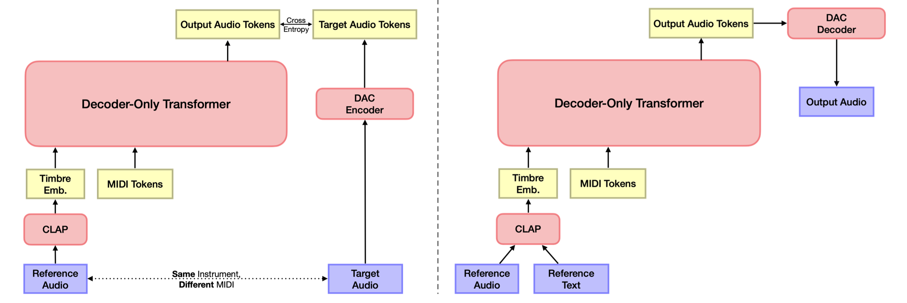

# TokenSynth: A Token-based Neural Synthesizer for Instrument Cloning and Text-to-Instrument


<div align="center">

[](https://github.com/KyungsuKim42/tokensynth/actions)
[](https://pypi.org/project/tokensynth/)
[](https://github.com/KyungsuKim42/tokensynth/blob/main/LICENSE)

[Kyungsu Kim](https://scholar.google.com/citations?user=bCMZWFIAAAAJ&hl=en&oi=sra), [Junghyun Koo](https://scholar.google.com/citations?user=9LbxECcAAAAJ&hl=en), [Sungho Lee](https://scholar.google.com/citations?hl=en&user=8yMXL5AAAAAJ), [Haesun Joung](https://scholar.google.com/citations?hl=en&user=yV8xVKoAAAAJ), [Kyogu Lee](https://scholar.google.com/citations?user=Fk4jQFEAAAAJ&hl=en)

📄 [Paper](https://arxiv.org/abs/2502.08939) | 🎵 [Demo Page](http://tinyurl.com/tokensynth-demo)


</div>

###  **Official implementation** of "TokenSynth: A Token-based Neural Synthesizer for Instrument Cloning and Text-to-Instrument", published in **ICASSP 2025**.

TokenSynth is a token-based neural synthesizer that generates polyphonic single-instrument musical audio from MIDI and timbre embeddings, enabling instrument cloning, text-to-instrument synthesis, and timbre manipulation. It uses a decoder-only transformer trained on neural audio tokens with CLAP-based timbre conditioning, allowing for flexible sound design without fine-tuning.

## Installation

To install TokenSynth, simply run:

```bash
pip install tokensynth
```

## Quickstart

```python
from tokensynth import TokenSynth, CLAP, DACDecoder
import audiofile
import torch

# Set file paths
ref_audio = "media/reference_audio.wav"
midi = "media/input_midi.mid"

# Initialize models
device = torch.device("cuda" if torch.cuda.is_available() else "cpu")
synth = TokenSynth.from_pretrained(aug=True, device=device)
clap = CLAP(device=device)
decoder = DACDecoder(device=device)

with torch.no_grad():
    # Extract timbre embeddings from audio and text
    timbre_audio = clap.encode_audio(ref_audio)
    timbre_text = clap.encode_text("warm smooth electronic bass")
    timbre_audio_text = 0.5 * timbre_audio + 0.5 * timbre_text

    # Generate audio tokens
    tokens_audio = synth.synthesize(timbre_audio, midi, top_k=10)
    tokens_text = synth.synthesize(timbre_text, midi, top_p=0.6, guidance_scale=1.6)
    tokens_audio_text = synth.synthesize(timbre_audio_text, midi, top_p=0.6, guidance_scale=1.6)

    # Decode tokens into audio waveforms
    audio_audio = decoder.decode(tokens_audio) 
    audio_text = decoder.decode(tokens_text)
    audio_audio_text = decoder.decode(tokens_audio_text)

# Save audio files
audiofile.write("media/output_audio.wav", audio_audio.cpu().numpy(), 16000)
audiofile.write("media/output_text.wav", audio_text.cpu().numpy(), 16000)
audiofile.write("media/output_audio_text.wav", audio_audio_text.cpu().numpy(), 16000)
```

You can also run `python quickstart.py` from the project root directory.

## Model Weights
TokenSynth automatically downloads pretrained weights when initialized.  
If you want to manually download the weights, you can find them here:  

[🔗 TokenSynth Pretrained Weights](https://huggingface.co/KyungsuKim/TokenSynth/tree/main)

## Citation

```bibtex
@misc{kim2025tokensynthtokenbasedneuralsynthesizer,
      title={TokenSynth: A Token-based Neural Synthesizer for Instrument Cloning and Text-to-Instrument}, 
      author={Kyungsu Kim and Junghyun Koo and Sungho Lee and Haesun Joung and Kyogu Lee},
      year={2025},
      eprint={2502.08939},
      archivePrefix={arXiv},
      primaryClass={cs.SD},
      url={https://arxiv.org/abs/2502.08939}, 
}
```
## LICENSE

This project is released under the [MIT License](./LICENSE)

### Acknowledgements:
This work utilizes codebase and pretrained weights of [DAC](https://github.com/descriptinc/descript-audio-codec) and [CLAP](https://github.com/LAION-AI/CLAP).

---

## CLAP FX Probe

TokenSynth 논문은 오디오 이펙트(EQ·디스토션·리버브)로 augmentation한 `TokenSynth-Aug`가
이펙트 걸린(wet) 오디오 복제에서 오히려 dry로만 학습한 기본 모델보다 못한 현상을 관찰하고,
그 원인을 "CLAP 임베딩이 오디오 이펙트 정보를 결여했기 때문으로 보인다"고 추정만 했다.
이 하위 프로젝트(`01_embed.py`, `02_analyze.py`, `03_mapping.py`)는 그 추정을 재학습 없이
직접 측정한다.

단, "차이 벡터가 전부 같은 방향인가"라는 단일 질문은 너무 엄격하다 — 방향이 소스마다
달라도 어떤 방법으로든 dry 임베딩에서 wet 임베딩을 예측할 수 있으면 실용적으로 충분하다.
그래서 단일 가설이 아니라 **구조의 위계(H0~H6)**로 측정한다 — 자세한 표는 아래 "결과 해석
기준" 참고.

### 설치

```bash
pip install -e ".[probe]"
```

> **알려진 문제**: pip가 `torchaudio`를 `torch`와 호환되지 않는 버전(예: torch 2.5.1 +
> torchaudio 2.11.0)으로 설치해 `_torchaudio.abi3.so` 관련 `OSError`가 날 수 있습니다.
> 발생하면 `torch`와 같은 마이너 버전으로 맞춰 재설치하세요: `pip install torchaudio==2.5.1`
> (설치된 `torch` 버전은 `python -c "import torch; print(torch.__version__)"`로 확인).

기존 TokenSynth 의존성(`laion-clap`, `torch` 등)에 더해 `pedalboard`, `scikit-learn`,
`scipy`, `soundfile`, `matplotlib`가 추가로 설치됩니다.

### 체크포인트

TokenSynth가 사용한 것과 **동일한** CLAP 체크포인트를 사용합니다. `01_embed.py`가 첫 실행 시
자동으로 다운로드하여 `ckpts/`에 캐시합니다 (약 2.2GB, `.gitignore`에 의해 git에는 포함되지 않음).

수동으로 받으려면:
```bash
mkdir -p ckpts
curl -L -o ckpts/music_audioset_epoch_15_esc_90.14.pt \
  https://huggingface.co/lukewys/laion_clap/resolve/main/music_audioset_epoch_15_esc_90.14.pt
```

### 데이터

[NSynth](https://magenta.tensorflow.org/datasets/nsynth) test split (약 4,096개 wav)을
상정합니다. train split(20GB+)은 불필요합니다. 파일명이 NSynth 규칙
(`{instrument}-{pitch}-{velocity}.wav`)을 따라야 악기/피치/패밀리 메타데이터가 파싱됩니다.
악기 패밀리(`instrument_family`)는 `{family}_{acoustic|electronic|synthetic}_{id}` 규칙에서
source-type 토큰 앞부분을 취해 파싱하므로 `synth_lead`처럼 이름에 밑줄이 있는 패밀리도
올바르게 처리됩니다.

### 실행

```bash
# 1. 이펙트 적용 + CLAP 임베딩 추출 (오디오는 디스크에 쓰지 않음)
#    소스 800개 권장 (300개는 통제 표본이 너무 적어 1차 실험에서 문제가 됐다) — M5 CPU 기준 약 40분
python 01_embed.py --audio-dir /path/to/nsynth-test/audio --n-sources 800 --out out

# 2. (a)(b)(c) 분석 + 그림 + 통제(레이블 셔플/무작위 벡터/악기 패밀리 분류)
python 02_analyze.py --embeddings out/embeddings.npz --out out

# 3. (d) 사상 모델(residual MLP) 학습 + H1~H5 위계 사다리 비교
#    out/results.json을 읽어 이어 붙이므로 반드시 2번 다음에 실행할 것
python 03_mapping.py --embeddings out/embeddings.npz --results out/results.json --out out
```

**환경**: 기본 `--device cpu`. Apple Silicon에서 `--device mps`를 쓰려면 먼저
`PYTORCH_ENABLE_MPS_FALLBACK=1`을 설정하세요 (CLAP 일부 연산이 MPS에 없어 CPU로 폴백 필요).
`01_embed.py`는 800 소스 기준 M-시리즈 CPU에서 약 40분 소요됩니다. `02_analyze.py`의
`--n-boot`(기본 1000)는 Ridge R² 부트스트랩 신뢰구간 반복 횟수로, 느리면 줄이세요.
`03_mapping.py`는 TokenSynth를 통과시키지 않는 작은 MLP만 학습하므로 M5 CPU에서 수 분이면
끝납니다. GPU 클러스터가 없는 환경을 상정해 **1단계(이 문서)에서는 TokenSynth 자체를
재학습하거나 건드리지 않으며 추론만 수행**합니다 (TokenSynth를 통과시키는 검증은
"2단계 — 상한 확인" 참고, 이번 구현 범위 밖).

### 출력

```
out/
├── embeddings.npz        임베딩 + 메타(src_id, effect, param_value, instrument, instrument_family, pitch)
├── embed_config.json     재현용 설정 기록
├── results.json          모든 수치 — (a)(b)(c) 측정, 통제, H0~H6 위계(hierarchy), 사상 모델(mapping_model)
├── probe_r2.png           ① R²(부트스트랩 95% CI) vs 셔플 통제 ② 분류 NMI — 이펙트 vs 악기 패밀리(단위 통일 비교)
├── direction_cos.png      ① 방향 일관성(정규화 후 코사인, signed 이펙트는 부호별 분리) vs 무작위 벡터 ② 크기-파라미터 Spearman ρ
├── monotonicity.png       (unsigned 이펙트만) 파라미터 값 vs 방향 벡터 투영값 산점도
├── signed_direction.png   (signed 이펙트만) 부스트(+)/컷(-) 분리 후 |파라미터| vs 투영값, cos(v_+, v_-) 표기
├── mapping_cos.png        사상 모델(H5) 성능 vs identity vs 셔플(동일 용량) 기준선
└── hierarchy.png          H1~H5 위계 사다리 비교 (이펙트별 3분할, identity/셔플 기준선 포함)
```

### 결과 해석 기준 — 구조의 위계 (H0~H6)

"차이 벡터가 전부 같은 방향인가"는 가장 엄격한 질문(H1)이다. 이게 깨져도 실험은 끝나지
않는다 — 아래 표에서 **어느 칸까지 구조가 잡히는지** 찾는 것이 목표다. 코드는 수치만
내고, 최종 판정은 이 표로 사람이 한다. **어느 칸에서 잡히든 유효한 결과다.**

| 단계 | 형태 | 의미 | `results.json`에서 볼 곳 | 실용적 귀결 |
|---|---|---|---|---|
| **H0** | 정보 없음 | 아무 방법으로도 못 읽음 | 아래 모든 지표가 통제 수준 | 별도 이펙트 인코더 필요 |
| **H1** | `e' = e + v` | 상수 벡터 | `hierarchy.<effect>.H1` | 벡터 하나만 더하면 됨 — 사실상 무료 |
| **H2** | `e' = e + f(p)·v` | 방향 고정, 크기만 파라미터 의존 | `hierarchy.<effect>.H2`, `direction_cos.png`②, `magnitude_spearman_rho` | 스칼라 함수 하나만 fit하면 됨 |
| **H3** | `e' = e + Δ(p)` | 파라미터별 방향, 소스와 무관 | `hierarchy.<effect>.H3` | 파라미터→벡터 룩업으로 충분 |
| **H4** | `e' = W·e + b` | 선형 변환, 소스마다 다르게 이동 | `hierarchy.<effect>.H4` | 작은 선형 계층 하나 추가 |
| **H5** | `e' = e + g(e, p)` | 비선형 (residual MLP) | `hierarchy.<effect>.H5`, `mapping_model.held_out_cos_real_labels` | MLP 추론 1회 — 여전히 실용적 |
| **H6** | 정보는 있으나 학습 불가 | 사실상 H0 | H1~H5가 전부 통제 수준에 머무름 | 별도 이펙트 인코더 필요 (H0과 동일 결론) |

**판정 방법**: `hierarchy.<effect>`의 각 칸(H1~H5)을 같은 이펙트의
`hierarchy.<effect>.identity`와 `hierarchy.<effect>.shuffle_control`(또는
`mapping_model.held_out_cos_shuffled_labels`)과 비교한다. **두 기준선을 모두 이기는 가장
앞선(단순한) 칸**이 그 이펙트가 위치한 위계다. 어느 칸도 두 기준선을 못 이기면 H6(=사실상
H0)으로 본다.

- **identity 기준선이 왜 필요한가**: `cos(e_dry, e_wet)`은 이펙트가 약하면 원래도 높게
  나온다. 이 기준선 없이는 "잘 예측했다"는 착시가 생긴다.
- **셔플 기준선의 "동일 용량" 조건**: `03_mapping.py`의 셔플 통제는 실제 모델과 **완전히
  같은 아키텍처·에폭·학습 절차**로, 레이블(=목표 `e_wet`)만 무작위로 섞어 학습한다.
  MLP는 용량이 크면 정보가 없어도 train loss를 낮출 수 있으므로, 반드시 held-out
  코사인으로만 비교하고 절대치가 아니라 **실제 레이블 모델과의 격차**를 신뢰할 것.
  **프로브(사상 모델)가 강력해질수록 이 통제의 중요성도 커진다.**
- **`probe_r2`에는 부트스트랩 95% CI(`probe_r2_ci_low`/`probe_r2_ci_high`)가 붙는다.**
  src_id를 복원추출로 재표집하고 뽑히지 않은 소스로 평가하는 소스 단위 부트스트랩이다.
  이펙트 간 R² 차이가 유의한지는 std가 아니라 이 CI로 판단할 것.
- **방향/크기를 반드시 나눠서 볼 것.** `direction_cosine_mean`(정규화 후 코사인, H1의 방향
  일관성)과 `magnitude_spearman_rho`(‖차이 벡터‖-파라미터 상관, H2의 크기 의존성)를
  분리하지 않고 정규화 없이 코사인만 재면, 소스마다 다른 벡터 크기가 방향 불일치로
  오인되어 H2인 경우를 H0으로 잘못 판정하게 된다.

#### 통제 — 단위를 반드시 맞춰서 비교할 것 (1차 실험의 결함 1)

1차 실험은 이펙트 프로브(R², 회귀)와 악기 통제(accuracy, 분류)의 단위가 달라 "악기는 잘
읽고 이펙트는 못 읽는다"는 핵심 대조가 성립하지 않았다. 게다가 개별 악기 47클래스/294샘플
≈ 클래스당 6개로 표본도 너무 적었다. 이번 판에서 고친 것:

- `controls.instrument_family` — 개별 악기 대신 **NSynth 패밀리 11종**(bass, brass, flute,
  guitar, keyboard, mallet, organ, reed, string, synth_lead, vocal)으로 바꿔 클래스당 표본을
  늘렸다. `accuracy`, `acc_chance_normalized`(=`(acc−chance)/(1−chance)`), `nmi`를 모두
  보고한다.
- `controls.instrument_family_7class_subsampled` — 악기 패밀리를 7종으로 무작위
  서브샘플링해, 이펙트의 7-way 분류 프로브와 **클래스 수를 완전히 맞춘** 버전.
- `effects.<effect>.probe_accuracy_7way` / `probe_nmi` / `probe_acc_chance_normalized` —
  파라미터가 이미 7단계 이산값이므로 R²와 별개로 분류 프로브도 돌린다.
- **NMI를 주 지표로 볼 것.** 클래스 수(이펙트 7종 vs 패밀리 11종/7종)가 달라 accuracy의
  우연 수준 자체가 다르다. NMI는 클래스 수와 무관해 `probe_r2.png`②에서 이펙트 3개와
  악기 패밀리(11종/7종)를 나란히 비교할 수 있다.

#### 스윕 강도 — "기계적 매칭" 대신 실무 상식 범위 사용 (1차 실험의 결함 2)

1차 실험에서 프로브 성적이 `distortion > reverb > highshelf` 순으로 나왔는데, 스윕
범위(reverb `room_size` 0~0.9, distortion `drive_db` 0~30, highshelf `gain_db` ±15)를
임의로 정한 것이라 이 순서가 "의미론적으로 더 잘 학습된 이펙트라서"인지 "단지 스윕이
지각적으로 더 큰 변화였기 때문"인지 구분이 안 됐다.

처음에는 오디오 도메인 거리(D_audio, log-mel 스펙트로그램 기반)로 세 이펙트의 "지각적
강도"를 사후에 기계적으로 맞춰보는 접근을 시도했다. 하지만 이건 "단위 음향 변화당
CLAP이 얼마나 잘 인코딩하는가"라는 기계적 질문에만 답할 뿐, **"실무에서 실제로 쓰는
세기에서 얼마나 잘 작동하는가"**라는 더 중요한 질문에는 답하지 못한다 — 예를 들어 EQ를
±60dB씩 거는 사람은 없다. 그래서 이 접근을 버리고, **애초에 스윕 범위 자체를 실무에서
흔히 쓰는 세기로 다시 잡았다** (`01_embed.py`의 `EFFECT_SPECS`):

| 이펙트 | 이전 범위 (1차 실험) | 현재 범위 (실무 상식선) |
|---|---|---|
| reverb `room_size` | 0.0 → 0.9 (카세드럴급까지 포함) | 0.0 → 0.5 (무반향~중대형 룸) |
| distortion `drive_db` | 0 → 30dB (헤비 퍼즈급까지 포함) | 0 → 15dB (미세~중간 새추레이션) |
| highshelf `gain_db` | −15 → +15dB | −9 → +9dB (일반적인 믹싱 EQ 부스트/컷) |

D_audio 계산, `encoding_efficiency`, 강도 매칭 프로브는 전부 뺐다 — 오디오 도메인 거리를
계산해 비교하는 "기계적" 접근 자체를 실험에서 제외하기로 했기 때문이다. 세 이펙트 간
순서 비교는 이제 이 실무 상식 범위 안에서의 프로브 R²/NMI를 그대로 보면 된다.

#### 부호 있는 파라미터 (1차 실험의 결함 3)

`highshelf`처럼 파라미터 범위가 0(dry)을 사이에 둔 대칭이면(`-9~+9`), 부스트(+)와
컷(-)이 반대 방향이라 **전역 평균 방향 벡터 하나로는 상쇄돼 무의미해진다** — 1차 실험의
`monotonicity_spearman_rho = -0.305`가 이 문제였다.

- `effects.<effect>.is_signed` — 파라미터 범위가 0을 걸치는지 자동 판정(코드가 직접
  데이터에서 min/max를 봄).
- signed 이펙트는 `direction_cosine_mean`/`monotonicity_spearman_rho`(pooled 버전)가
  `null`이다 — 의미가 없어서 일부러 비웠다. 대신 `direction_positive` / `direction_negative`
  (각각 부호 그룹 내에서 계산한 방향 일관성 + `|param|` 기준 단조성)를 본다.
- `cos_pos_neg` — 부스트 방향 벡터와 컷 방향 벡터의 코사인. **-1에 가까우면 부스트와
  컷이 같은 축의 양방향이라는 뜻**이고, 이는 그 자체로 의미 있는 발견이라 항상 보고한다.
- `n_neutral_excluded_rows` — 무효과 레벨(`param≈0`)은 방향 계산에서 제외되며, 제외된
  행 수가 여기 기록된다 (1차 실험에서 highshelf 레벨 3이 정확히 이 경우였다 — 그 지점의
  diff 벡터가 거의 0이라 방향이 정의되지 않았다).
- unsigned 이펙트(reverb, distortion)는 기존 방식 그대로 — `monotonicity_spearman_rho`와
  `magnitude_spearman_rho`가 대칭 범위 문제 자체가 없으므로 `..._abs_param` 필드와 함께
  참고용으로만 보면 된다.

#### 추가 점검: 무효과 레벨이 진짜 dry와 같은가

`effects.<effect>.neutral_level_cos_check` = `cos(e_dry, e_at_param==0)`. 1.0에 가까워야
"레벨 0(혹은 중립 레벨)이 진짜 dry와 다르지 않다"는 뜻이다. reverb는 `room_size=0`이어도
`wet_level=0.4`가 항상 섞이므로 1.0에서 유의하게 떨어질 수 있다 — 그러면 reverb 스윕이
dry와 매끄럽게 이어지지 않는다는 뜻이니 `Reverb(...)` 파라미터를 재검토해야 한다. 세
이펙트 모두 이 값을 확인할 것.

### 2단계 — 상한 확인 (이번 구현 범위 밖)

> 진짜 wet 오디오 → CLAP → 임베딩 → TokenSynth → 실제로 wet 소리가 나는가?

이것이 사상 모델(H5) 성능의 상한이다. 진짜(실측) wet 임베딩으로도 TokenSynth가 wet을
재현하지 못한다면, 사상 모델이 만든 근사 임베딩으로는 당연히 안 된다 — 사상 모델이 아무리
`e_wet`에 가까운 벡터를 만들어도, 그 벡터가 실제 오디오에서 나올 수 있는 영역
밖(off-manifold)이면 TokenSynth는 (진짜 오디오에서 나온 임베딩만 보고 학습했으므로)
알아듣지 못한다.

- **낸다** → 임베딩에 정보가 있고 TokenSynth도 그 정보를 읽는다. `TokenSynth-Aug`의 실패는
  학습 문제였다는 뜻.
- **못 낸다** → 조건화(conditioning) 구조 자체를 바꿔야 한다는 뜻.

1단계(이 문서에 구현된 스크립트)의 결과를 본 뒤 진행할 후속 과제로, 이번 구현에는
포함되지 않는다.
