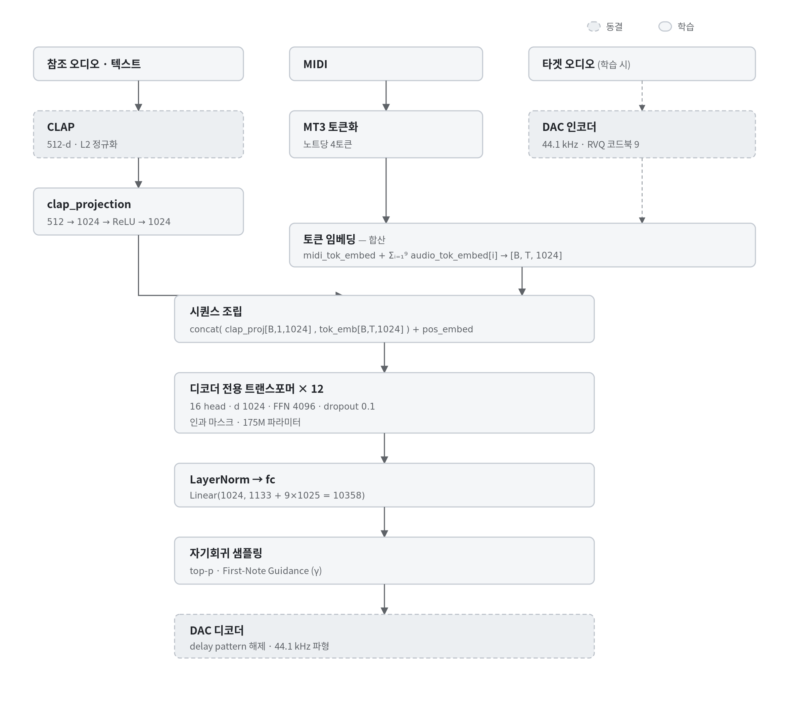
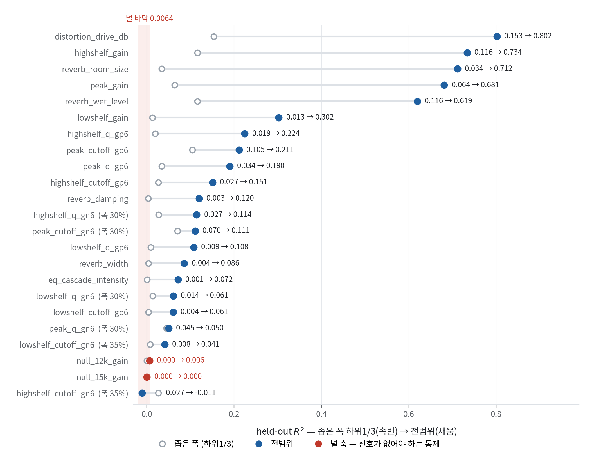
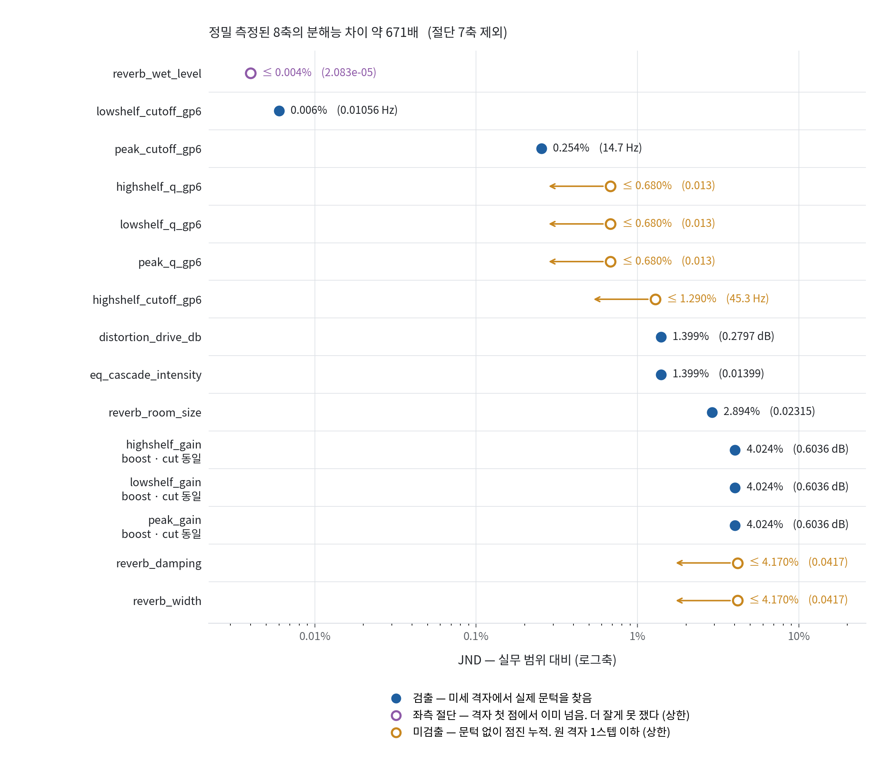
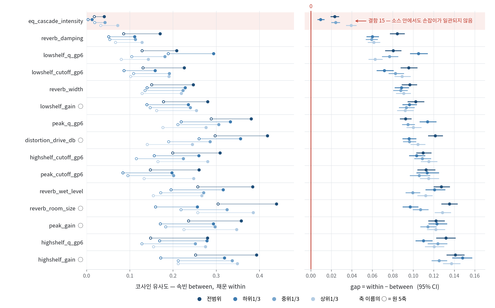
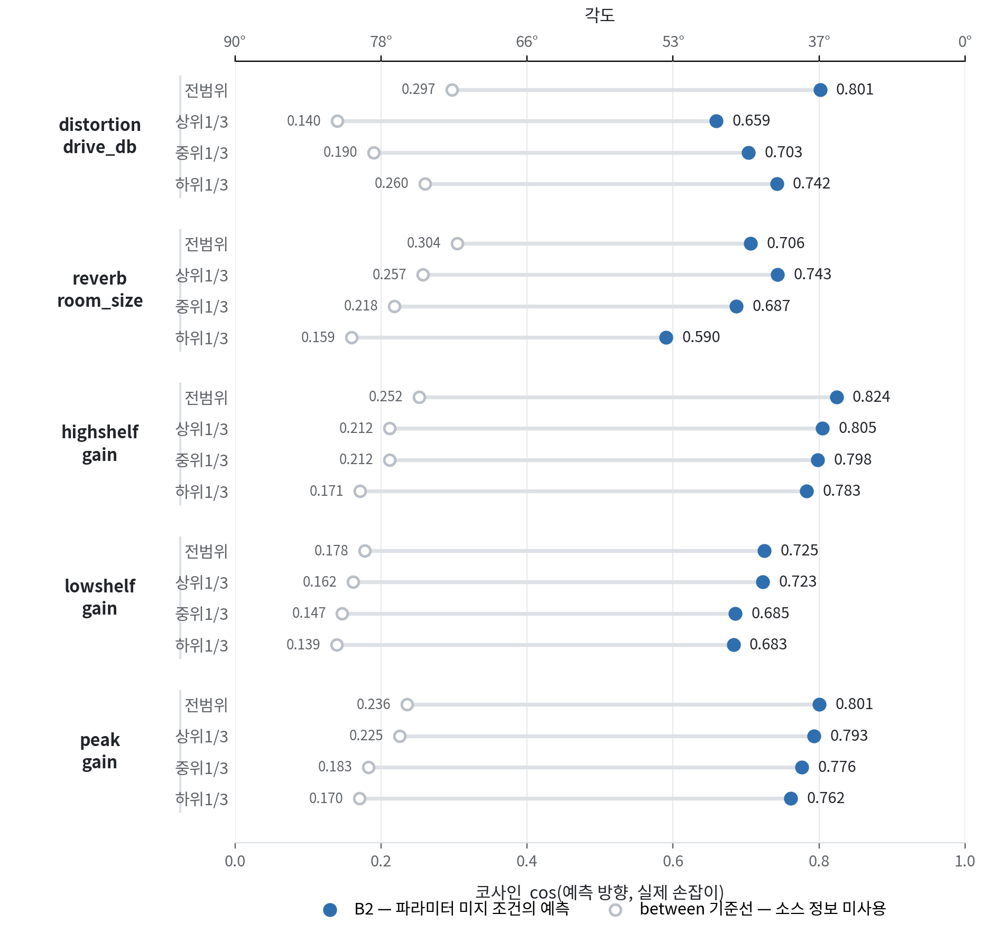
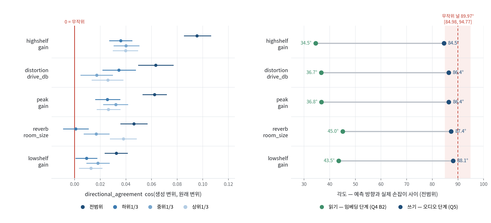
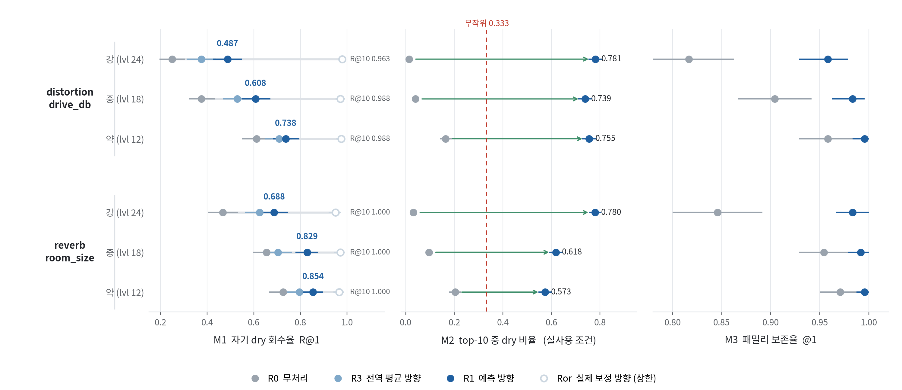

<!-- docs/개인_포트폴리오_논문_최종.docx 를 pandoc 으로 변환한 파일이다.
     docx 가 정본이며 여기서는 두 가지만 교정했다.
       · Ⅱ장 §5 가 둘이던 것을 §5(R² 범위 종속성) / §6(AMI) 로 분리
       · 참고문헌 번호를 각주 등장 순서에 맞게 재정렬
     수식은 GitHub 이 렌더링하는 $…$ 표기, 그림은 docs/paper_media/ 에 있다. -->

**CLAP 음색 임베딩의 오디오 이펙트 정보: TokenSynth의 성능 향상을 중심으로**

| **작성자** | 김성현 / 첨단융합학부                                             |
|------------|-------------------------------------------------------------------|
| **학번**   | 2025-16318                                                        |
| **실험일** | 2026.07.29 ~ 2026.09.06                                           |
| **핵심어** | CLAP 임베딩, 표현 프로빙, 오디오 이펙트, 신경 합성기, 임베딩 검색 |

# 초록

CLAP 음색 임베딩이 오디오 이펙트 정보를 담는지, 담는다면 그 정보로 이펙트를 제어할 수 있는지를 측정했다. 대상은 TokenSynth가 증강 학습의 음색 지표 저하 원인으로 추정했으나 측정하지는 않은 진술이다. NSynth 1200개 소스에 이펙트 3계열 23축을 각 25레벨로 적용해 575000회 렌더링하고, Q1~Q6 6가지 질문에 답했다. 이펙트 정보는 존재하며, 악기 정체성보다는 유의하게 약하다. 이펙트를 조작하는 방향은 소스마다 다르며, 그 방향은 임베딩만으로 예측된다. 그러나 그 방향으로 조건 벡터를 이동시켜 오디오를 생성하면 유의하지 않은 결과가 나온다. 손실 지점을 Projection 층의 국소 유효계수, 프리픽스 토큰 하나를 공유하는 조건 채널의 경쟁, 자기회귀 샘플링 잔차로 특정하여 대응하여 성능이 1.77배가 향상되었으나 실용 수준에는 이르지 못했다.

세 장애가 모두 생성기 내부에 있다는 점에 착안하여 생성기를 경유하지 않는 검색 과제로 같은 방향 정보를 보냈더니, 회수율이 6가지 조건에서 유의하게 개선되었으며 악기 패밀리 보존율은 하락하지 않았다. 동일한 방향 정보가 한 경로에서만 살아남았다는 것은 병목이 표현이 아닌 생성 경로에 있음을 뜻한다.

# Ⅰ. 서론

## 1. 연구의 배경 및 필요성

사운드 디자인에는 주어진 악기에서 몇몇 이펙트를 제거한 음색을 요구할 때가 있다. 이는 “역방향 문제”로 정방향 (Dry 소리에 이펙터를 거는 것)이 결정론적 DSP인 것에 반해 파라미터를 모르는 상황에서 원래 음색을 복원해야 하기에 더욱 까다롭다. 다만 목표를 정확히 규정하면 문제가 완화된다. 원본 녹음에서 이펙터 성분을 물리적으로 제거하는 것이 아닌, 이펙터가 적용되지 않는 버전의 음색을 새로 연주하는 것이다. 음색을 표현하는 어떠한 잠재 표현을 얻고, 그 표현 위에서 이펙터 성분을 뺀 지점으로 이동한 뒤 다시 합성하면 된다. TokenSynth가 정확히 그 구조를 가진다.

**그림 1.** TokenSynth 구조. 점선은 학습 중 동결되는 모듈이다. 음색은 맨 앞 프리픽스 토큰 하나로만 전달된다.

TokenSynth는 MIDI 토큰과 CLAP 음색 임베딩을 조건으로 오디오 토큰을 자기회귀 생성하는 신경망 기반의 신디사이저이다[^1]. 구조상 모델이 음색에 대해 보는 것은 512차원의 벡터 하나 뿐이기에, 벡터가 담지 못하는 정보는 모델이 원리적으로 사용할 수 없다.

저자들은 EQ, 디스토션, 리버브로 Augmentation한 TokenSynth-Aug를 학습시켰으나 wet 오디오에서 음색 유사도와 스펙트럼 재현은 오히려 원본 학습 모델에 미치지 못했다. (MSS 0.826 vs 0.754; CLAP score 0.790 vs 0.795, Ref$\neq$Tgt$\cdot$Wet 조건). 저자들은 이 중 이펙트 적용의 부정확성을 “*CLAP 모델의 음색 임베딩이 오디오 이펙트 정보를 결여하고 있기 때문(likely due to)”* 으로 추정했다. (Kim et al., 2025, p.4). 그러나 이 추정을 임베딩 측정을 통해 구체화한 절차는 논문에서 확인되지 않는다. 이 미검증 진술은 본 연구가 목표하는 도구의 성립 조건과 정확히 같은 문장이다.

## 2. 연구 목적 및 연구 질문

본 연구에서는 6가지의 연구 질문을 통해 이펙트를 제거해 연주할 수 있는 도구를 만들 수 있는지에 대한 가능성을 탐구하고자 한다.

**Q1.** CLAP 임베딩에 이펙트 정보가 있는가?

**Q2.** 있다면 악기 정체성 대비 얼마나 강한가/약한가?

**Q3.** 이펙트를 조작하는 방향이 소스마다 다른가?

**Q4.** 그 방향을 예측할 수 있는가?

**Q5.** 예측한 방향이 실제 생성 오디오에 반영되는가?

**Q6.** 생성이 아닌 다른 경로로는 전달되는가?

Q1, Q2는 논문 진술의 직접 검증이며, Q3~Q6는 도구의 성립 조건이다. Q6는 Q5가 부정된 후의 질문이다. 임베딩 단계에서 방향 정보가 살아있는데 (Q4) 왜 쓸 수 없는가를 다시 물으며 생겼다. Q1~Q5와 독립적으로 별도 시점에 작성되었다.

또한 Q4와 Q5는 다른 문제인데, Q4는 정보의 존재만으로 그것을 보는 함수를 우리가 직접 만들 수 있으나, Q5는 TokenSynth를 함수로 가져 우리가 바꿀 수 없는, 역문제이다. 다시 말해, TokenSynth가 만약 이펙트 정보를 가지고 있는 부분공간을 선형사상으로 묻히게 만든다면 이는 출력에 어떠한 영향도 줄 수 없다. 게다가 이가 묻혀지지 않는다 하더라도 악기 신호가 이펙트 신호보다 더 강하다면 더 강한 성분에 의해 묻히게 될 가능성도 있다.

따라서 이를 우회하기 위해 Q6, 즉 TokenSynth의 성질을 사용하지 않는 우회로가 있는지 탐구할 수 있도록 Q6를 설계했다. (Q6에서는 EQ를 사용하지 않는다. EQ는 역방향 필터가 존재하기에 다른 도구를 사용할 이유가 없다.)

$\begin{matrix}
\text{생성}:\quad e_{\text{wet}} \rightarrow {\widehat{e}}_{\text{dry}}\overset{g}{\rightarrow}\text{오디오} \\
\text{검색}:\quad e_{\text{wet}} \rightarrow {\widehat{e}}_{\text{dry}} \rightarrow \underset{x \in \mathcal{L}}{\arg\max}\cos\left( {\widehat{e}}_{\text{dry}},e\left( x \right)) \right) \\
\end{matrix}$ (1)

설령 Q5가 실패하더라도 Q6가 성공한다면 실무적으로도 열등하지 않다. 사운드 디자이너는 통상 대규모 샘플 라이브러리를 보유하며, 생성된 소리보다 실제 녹음 샘플을 선호한다. 생성 도구의 품질 상한은 모델 성능이지만, 검색 도구의 품질 상한은 라이브러리 자체 품질이다.

## 3. 연구 범위와 방법

본 연구는 MacBook M5 CPU로 단독학습 되었다.

# Ⅱ. 이론적 배경 및 선행 사례

## 1. CLAP 임베딩

CLAP(Contrastive Language-Audio Pretraining[^2]) 임베딩은 오디오와 텍스트를 동일한 Multimodal Space에 매핑하여 서로 비교, 정렬할 수 있도록 만든 표현 방식이다. CLAP은 오디오 인코더 $f_{a}$와 텍스트 인코더 $f_{t}$를 (오디오, 캡션) 쌍의 대조 손실로 정렬한다.

$\mathcal{L} = - \frac{1}{N}\sum_{i = 1}^{N}{\log\frac{\exp\left( \left\langle f_{a}\left( x_{i} \right),f_{t}\left( c_{i} \right) \right\rangle/\tau \right)}{\sum_{j = 1}^{N}{\exp\left( \left\langle f_{a}\left( x_{i} \right),f_{t}\left( c_{j} \right) \right\rangle/\tau \right)}}}$ (2)

*배치 내에서 위 목적함수가 요구하는 것은 캡션이 다른 오디오를 구분하는 것이다. 즉, “Violin”과 “Piano”는 캡션이 다르기에 구분할 수 있으나, “Dry Violin”과 “Reverb가 걸린 Violin”은 캡션이 같은 가능성이 높기에 구분할 유인이 없다. 캡션 코퍼스에서 “Distorted”, “Reverberant” 등의 단어가 등장하는 빈도는 악기명보다 훨씬 낮으므로, 대조 손실은 이펙트 축을 압축하고 악기 축을 확장하는 방향으로 표현을 형성할 유인을 가진다. 그러나 반대로 이야기하면, 위와 같은 단어들이 코퍼스에 존재하는 한 이펙트 정보는 CLAP에 담겨있지 않을 이유가 없다.*

*CLAP 임베딩은 L2 정규화되어 단위 초구* $S^{511} \in \mathbb{R}^{512}$ 위에 놓인다. 따라서 두 임베딩의 자연스러운 거리는 코사인이고, 변위는 구면 위의 현이다. 균일하게 뽑은 두 단위 벡터 사이 각도 $\Theta$는

$\mathbb{E}\left\lbrack \cos\Theta \right\rbrack = 0,\quad\text{sd}\left( \cos\Theta \right) = \frac{1}{\sqrt{d}}$ (3)

$d = 512$ *라면* $sd \approx 0.0442$, 각도로는 $90^{\circ} \pm {2.53}^{\circ}$다. 즉 512차원에서의 두 벡터가 무관하다면 위 범위 내에 있어야 한다.

## 2. Probe

Probe는 임베딩 벡터 위에 얕은 모델을 얹어 속성의 선형 분리 가능성을 잴 수 있도록 하는 도구이다. 만약 Probe가 너무 깊다면, 레이블을 외우게 되어 스스로 데이터를 맞춰버릴 수 있다. 본 연구에서는 이를 막기 위해 상한 대조 기법을 사용했다. 즉, 악기를 구분할 수 있으면 이는 충분히 깊은 프로브라는 뜻인데, 이펙트를 위 프로브로 구분할 수 없다면 표현 자체의 속성으로 규명하는 것이다.

## 3. 멜 스펙트로그램

*멜 스펙트로그램은 소리를 벡터로 변환해주는 기술이다. 시간에 따른 공기압 변화를 짧은 시간 동안의 푸리에 변환을 통해 주파수 구성을 분석한다. 이를 연속해서 이어붙여 2차원 그림으로 스펙트로그램을 구성할 수 있다. 이를 멜(Mel), 즉 사람 귀에 맞도록 저역을 더 강화시킨 것이 멜 스펙트로그램이다.*

## 4. 오디오 이펙트의 수학적 성격

*본 연구에서 사용하는 세 가지 이펙트는 수학적으로 서로 다른 부류에 속한다.*

**표 1.** 오디오 이펙트 세 계열의 수학적 성격과 멜 스펙트로그램에서의 가시성.

| ***이펙트***           | ***부류***       | ***성질***                                      | ***멜 스펙트로그램***   |
|------------------------|------------------|-------------------------------------------------|-------------------------|
| ***EQ (Shelf, Bell)*** | *선형, 시불변*   | *역필터 존재*                                   | *프레임마다 직접 보임*  |
| ***Distortion***       | *비선형, 시불변* | $y = \tanh\left( \text{gx} \right),\ $ *비가역* | *프레임마다 직접 보임*  |
| ***Reverb***           | *선형, 시변*     | *시간축 확산*                                   | *프레임 간 관계에 실림* |

*CLAP의 오디오 인코더(HTSAT)는 멜 스펙트로그램을 입력으로 받는다. 즉, STFT(단시간 푸리에 변환) 후의 크기만 쓰인다. 이는 이펙트 별 결과 차이에 대한 이론적 근거를 제시한다.*

## 5. $\mathbf{R}^{\mathbf{2}}$ 의 범위 종속성

$R^{2}$ 은 파라미터 스윕 범위에 종속되며 그 이유는 다음과 같다.

파라미터 $\theta$를 구간 $\left\lbrack \theta_{a},\theta_{b} \right\rbrack$에서 스윕하고, 임베딩에서 $\theta$을 회귀한다고 가정하자. 이는 임베딩을 다음과 같이 분해한다.

$e_{s}\left( \theta \right) = \underset{\text{source~dependent}}{\overset{\mu_{s}}{︸}} + \underset{\text{effect~dependent}}{\overset{h_{s}\left( \theta \right)}{︸}} + \underset{\text{noise}}{\overset{\epsilon}{︸}}$ (4)

*Probe의* $R^{2}$는 설명된 분산의 비율이므로 대략,

$R^{2} \approx \frac{Var(h_{s}\left( \theta \right))}{\text{Var}\left( h_{s}\left( \theta \right) \right) + \sigma_{\text{noise}}^{2}}$ (5)

*여기서* $Var(h_{s}\left( \theta \right))$는 파라미터 스윕 범위의 폭에 따라 커지지만, 잡음은 범위와 무관하게 일정하다. 즉, 범위를 넓히면 $R^{2}$은 1에 가까워지며, 범위를 좁히면 $R^{2}$은 0에 가까워진다. $R^{2}$은 신호 대 잡음 비(SNR, Signal to Noise Ratio)의 단조증가 함수이고, 범위 선택이 그 SNR을 결정한다.

본 연구는 이를 정량화하기 위해 축끼리 비교하기 위한 범위 무관 지표를 분해능으로 새로 설정하였다. 인접 격자점 사이의 변위가 잡음 바닥을 넘는 최소 스텝을 측정하여, 이를 기반으로 실험하였다.

$\text{JND}\left( \theta \right) = \min\left\{ \Delta: \parallel e_{s}\left( \theta + \Delta \right) - e_{s}\theta \parallel > \text{Null~floor} \right\}$ (6)

## 6. AMI

*악기 정체성과 이펙트 강도를 비교하려면 같은 척도가 필요하다. 그러나 두 과제는 클래스 수가 다르다. 이는 정규화 상호정보량(NMI)이 우연 수준에서 0으로 수렴하지 않도록 한다.*

$\text{NMI}\left( X;Y \right) = \frac{I\left( X;Y \right)}{\sqrt{H\left( X \right)H\left( Y \right)}}$ (7)

*클래스 수가 다른 두 과제를 NMI로 비교할 수 없으니, 이를 조정 상호정보량*[^3] (*Adjusted MI)로 보정한다.*

$\text{AMI}\left( X;Y \right) = \frac{I\left( X;Y \right) - \mathbb{E}\left\lbrack I\left( X;Y \right) \right\rbrack}{\max\left\{ H\left( X \right),H\left( Y \right) \right\} - \mathbb{E}\left\lbrack I\left( X;Y \right) \right\rbrack}$ (8)

*여기에 해석이 명확한 불확실성 계수(레이블 엔트로피의 몇 %를 표현이 회복하는가)를 병기한다.*

$U\left( Y|X \right) = \frac{I\left( X;Y \right)}{H\left( Y \right)}$ (9)

다만 이펙트 레벨은 순서형이고 악기 패밀리는 명목형인데, MI 지표는 분할표만 보므로 순서 정보를 버린다. 이는 이펙트 쪽에 불리하게 적용되기 때문에 본 연구는 모든 MI 비교에 연속 $\theta$ 회귀의 $R^{2}$을 병기했다.

# Ⅲ. 분석 및 결과

## 1. 측정 대상의 정의

소스 $s$와 파라미터 축 $\theta$에 대해, 격자 $\theta_{1} < \cdots < \theta_{L}$에 대해 임베딩 궤적($\mathcal{T}$)은 다음과 같이 정의한다.

$\mathcal{T}_{s} = \left\{ e_{s}\left( \theta_{1} \right),\ldots,e_{s}\left( \theta_{L} \right) \right\} \subset S^{511}$ (10)

$\left\lbrack \theta_{a},\theta_{b} \right\rbrack$에서 손잡이는 다음과 같이 정의한다.

$v_{s}^{\left\lbrack a,b \right\rbrack} = e_{s}\left( \theta_{b} \right) - e_{s}\left( \theta_{a} \right)$ (11)

손잡이의 소스 고유성은 패밀리 $F$로 묶어 정규화된 손잡이 ${\widehat{v}}_{s}$의 코사인을 분해해 얻는다.

$\text{within} = \mathbb{E}\left\lbrack \left\langle {\widehat{v}}_{s},{\widehat{v}}_{s'} \right\rangle \mid F\left( s \right) = F\left( s' \right) \right\rbrack,\quad\quad\text{between} = \mathbb{E}\left\lbrack \left\langle {\widehat{v}}_{s},{\widehat{v}}_{s'} \right\rangle \mid F\left( s \right) \neq F\left( s' \right) \right\rbrack$ (12)

$\ gap\  = \ within\ –\ between$ *으로 정의하여 악기군이 설명하는 몫을 얻도록 했다. Between은 동시에 전 소스에 고정 방향 하나를 쓸 때의 성능이므로 예측 모델의 기준선이 된다.*

*궤적이 휘는 정도와 context가 바뀔 때 손잡이가 도는 정도를 다음과 같이 구분한다. 또한 이를 무작위 널과 대조해야 해석된다.*

$\begin{matrix}
\text{bend}\left( \theta_{i} \right)\& = \arccos\left( \cos\left( \delta\left( \theta_{i} \right),\delta\left( \theta_{i + 1} \right) \right) \right),\quad\quad\delta\left( \theta_{i} \right) = e\left( \theta_{i + 1} \right) - e\left( \theta_{i} \right) \\
\text{rot}\left( b \right)\& = \arccos\left( \cos\left( v_{A}\left( b_{0} \right),v_{A}\left( b \right) \right) \right)\quad\quad b:\text{다른}\text{~}\text{파라미터의}\text{~}\text{값} \\
\end{matrix}$ (13)

*오디오 단계 지표는 변위방향을 보도록 설정한다.*

$\text{da} = \cos\left( \underset{v_{\text{generated}}}{\overset{e_{\text{regen}}\left( {\widehat{e}}_{\text{dry}} \right) - e_{\text{regen}}\left( e_{\text{wet}} \right)}{︸}},\,\underset{v_{\text{original}}}{\overset{e_{\text{dry}} - e_{\text{wet}}}{︸}} \right)$ (14)

*검색 단계 지표 M1, M2, M3는 다음과 같이 설정한다. 라이브러리* $\mathcal{L}$는 1200개 소스의 명시적 bypass 임베딩으로 구성한다. 질의는 소스 $s$를 레벨 $l$로 렌더링한 $e_{\text{wet}}$이며, 변위를 가해 이동시킨다.

$q\left( \alpha \right) = \frac{e_{\text{wet}} + \alpha\widehat{v}}{\left\| e_{\text{wet}} + \alpha\widehat{v} \right\|},\quad\quad\widehat{v} \in \left\{ {\widehat{v}}_{\text{B2}},{\overline{v}}_{\text{global}},v_{\text{true}} \right\}$ (15)

***M1 – 자기 dry 회수율.** 정답은 소스* $s$*의 Bypass 항목이다.*

$R@k = \frac{1}{\left| \mathcal{T} \right|}\sum_{s \in \mathcal{T}}^{}\mathbb{1}_{\text{rank}\left( e_{\text{bypass}\left( s \right)}|q_{s} \right) < k}$ (16)

*M1의 정답은 dry파일과 wet 파일이 모두 실제하기에 사람의 판단이 개입하지 않는다. M1을 이용하여 예측한 방향이 진짜 dry 소리를 내는지 청취 검증 없이 검정할 수 있다.*

***M2 – leave-source-out dry 비율.** 소스* $s$*의 모든 항목을 라이브러리에서 제거한 뒤, 상위* $k$*개 중 dry 태그 항목의 비율을 본다. 실사용 시나리오에 대응한다. 얼마나 dry 한 것을 회수했냐와 관련된 지표이므로, CLAP 외부의 물리 지표를 사용한다. Distortion에 대해서는 전고조파 왜곡률, Crest-Factor (Peak – RMS), 스펙트럼 무게중심을 이용하며, Reverb에 대해서는 에너지 포락선과 note-off 이후 잔향 에너지 비율, C50 및 C80 (명료도, 0~50(80)ms 에너지 / 50(80)~ms 에너지 비율) 을 사용한다.*

***M3 – 패밀리 보존율.** 검색 결과가 질의와 같은 악기 패밀리인 비율. Dry 방향으로 이동하다 악기 정체성이 바뀌면 도구로 성립하지 않기에 반드시 병기한다.*

## 2. 실험 설계

Nsynth test split 1200개를 활용한다[^4]. (10개의 패밀리에 대해 120개씩 데이터가 존재) 이펙터는 Pedalboard를 사용한다[^5]. 유한차분의 성립을 위해 결정론적 이펙터를 사용한다. 인코더는 논문과 동일한 music\_audioset\_epoch\_15\_esc\_90.14.pt를 활용한다. 48kHz 리샘플, 모노, 4초 고정, 피크 정규화 0.7으로 모든 오디오를 전처리한다. 더불어 Nsynth는 소스의 25%가 reverb와 관련된 태그를 가지며, 23%가 distortion과 관련된 태그를 가진다. 이들을 제외하는 것이 좋지만, 태그가 악기 패밀리와 상관관계가 있음은 자명했기에 Q2의 비교를 직접 교락시킨다고 판별해 특별히 대응하지 않았다.

TokenSynth 저장소에서는 Augmentation과 관련된 코드가 없었기에, 상류 저장소를 통해 Koo et al. 2023[^6]의 Augmentation을 따른다. OAT(one-at-a-time) 격자로 설계, 즉 축만 변화시키고 나머지는 고정시킨다. 그에 따라 설계된 축 구성은 다음과 같다.

**표 2.** 축 구성 — 계열별 파라미터 범위와 고정 조건.

<table><thead><tr class="header"><th><strong>EQ Gain</strong></th><th>
대표 Cutoff 고정, Q = 0.7071

<strong>highshelf_gain</strong> : -15 ~ +15 dB @ 2000 Hz <strong>lowshelf_gain</strong> : -15 ~ +15 dB @ 100 Hz <strong>peak_gain</strong> : - 15 ~ +15 dB @ 1000 Hz
</th><th>3 axis</th></tr></thead><tbody><tr class="odd"><td><strong>EQ cutoff</strong></td><td>
gain ±6 dB 고정

<strong>highshelf_cutoff :</strong> 500 ~ 4000 Hz <strong>lowshelf_cutoff :</strong> 30 ~ 200 Hz 
<strong>peak_cutoff :</strong> 200 ~ 6000 Hz
</td><td>6 axis</td></tr><tr class="even"><td><strong>EQ Q</strong></td><td>{Gain +6dB, Gain -6dB} × 3 Type</td><td>6 axis</td></tr><tr class="odd"><td><strong>Distortion</strong></td><td>Drive dB (0 ~ 20dB)</td><td>1 axis</td></tr><tr class="even"><td><strong>Reverb</strong></td><td>Wet_level (0 ~ 0.5), room_size (0.05 ~ 0.85), damping (0 ~ 1.0), width (0 ~ 1.0)</td><td>4 axis</td></tr><tr class="odd"><td><strong>Cascade</strong></td><td>
Eq_cascade_intensity (0 ~ 1.0)

100Hz, 400Hz, 2000Hz, 3000Hz, 6500 Hz lowshelf, 3band, highshelf 직렬 적용 (랜덤 변위)
</td><td>1 axis</td></tr><tr class="even"><td><strong>NULL</strong></td><td>Ultrasonic shelf 12kHz ⋅ 15kHz</td><td>2 axis</td></tr></tbody></table>

주축 21개, 널 2개에 대해 각 25레벨, 즉 575000회 렌더링을 시행했다.

다만 Cascade에서 원본 highshelf 기본값이 8kHz였으나, 사용하는 오디오인 NSynthsms 16kHz, Nyquist는 8kHz, 즉 경계와 같아 원본 그대로 재현할 수 없었기에 (시간축 에일리어싱) 6500Hz로 대체했다.

초음파 널은 파이프라인 누수 하한선으로, 원리적으로 아무 효과도 주지 않는다.

EQ에서 gain이 0이라면 Cutoff, Q 값과 관계없이 출력이 변하지 않는다. Reverb 역시도 wet\_level이 0이라면 동일한 현상이 일어난다. 따라서 gain ±6 dB 및 wet\_level = 0.3으로 기준점을 설정했다. 더불어 Gain을 한 축으로 통합하지 않고 음양을 구분한 이유는 임베딩 변위의 코사인 값이 유의하기 때문이다.

$\cos\left( v_{\text{gain} +},v_{\text{gain} -} \right) = \left\{ \begin{matrix}
 - 0.499 & \text{highshelf~}\left( {119.9}^{\circ} \right) \\
 - 0.684 & \text{lowshelf~}\left( {133.2}^{\circ} \right) \\
 - 0.758 & \text{peak~}\left( {139.3}^{\circ} \right) \\
\end{matrix} \right.\ $ (17)

Distortion은 수학적인 무효화 값이 존재하지 않는다.

$\text{distortion}\left( x \right) = \tanh\left( x \cdot 10^{g/20} \right)$ (18)

위 식에서 g를 어떻게 변화시켜도 항등이 되지 않는다. 더불어서 Pedalboard의 리버브를 이용하면 wet\_level이 0이어도 알 수 없는 이유로 항등이 되지 않았다. 따라서 $e_{\text{bypass}}$, 즉 프로세서를 통과시키지 않은 진짜 dry 소스와 $e\left( \theta_{\min} \right)$, 즉 프로세서의 개입이 최소화된 두 값을 구분한다. 손잡이와 JND, 용량 반응은 전부 $e\left( \theta_{\min} \right)$ 로 측정한다. 이를 분리하지 않으면 첫 스텝에서의 점프가 나머지 구간보다 커져 곡선 전체가 오염되기 때문이다. 그리고 $\text{insertio}n_{c}ost = \cos\left( e_{\text{bypass}},e\left( \theta_{\min} \right) \right)$을 별도 지표로 측정하였다.

Q1을 판별하기 위해 축마다 25레벨 임베딩에 릿지 프로브를 적합해 held-out $R^{2}$을 낸다. 단일 범위가 아닌, 구간 중심 및 구간 폭의 2차원 곡면으로 산출한다. 셔플 라벨과 널 축 두 가지로 통제한다. 다만 $R^{2}$은 범위 종속이므로 축 간 비교를 위한 JND를 측정한다.

Q2을 판별하기 위해 AMI를 이용하여, 상한 통제 역할의 악기 분류에 비해 프로브가 읽어낼 수 있는 정보를 얻어낸다. 악기 10종을 비교하는 프로브가 악기에 비해 이펙트를 얼마나 잘 읽어내는지 ML을 진행한다.

Q3을 판별하기 위해 소스 별 변위 벡터를 단위화한 뒤에, 동일 소스 내 within, between을 비교한 gap의 95% CI를 소스 단위 부트스트랩으로 낸다.

Q4을 판별하기 위해 MLP 듀얼헤드 (512 $\rightarrow$ 1024 $\rightarrow$ 512), 코사인 손실, 패밀리 층화 80/10/10을 train, validation, test로 나누어 학습하였다. 패밀리 라벨은 학습에서 제외하였다. 파라미터 값을 모르는 조건에서 그 방향을 예측할 수 있는지 검정하였다. 다만 Q4부터는 많은 컴퓨팅 소스가 필요하기에 21 주축을 전부 돌리지 않고 대표 5축 – drive\_db, room\_size, highshelf gain, lowshelf gain, peak gain에 대해서만 실행한다.

Q5을 판별하기 위해 예측 방향으로 이동시킨 임베딩을 TokenSynth에 주입, 오디오를 생성하여 이를 다시 CLAP으로 인코딩해 변위 방향을 원본과 비교한다. ($\text{da}$ 측정)

Q6을 판별하기 위해 검색단계 지표를 활용한다. 4개의 팔을 비교할 것이다.

**R0. 무처리 :** $q = e_{\text{wet}}$ - 기준선

**R1. 예측 방향 :** $q = unit\left( e_{\text{wet}} + \alpha\widehat{v} \right)$ – 진짜 질문

**R3. 전역 평균 방향 :** $q = unit\left( e_{\text{wet}} + \alpha\overline{v} \right)$ – 소스 정보가 없는 대조군

**Ror. 실제 보정 방향 :** $q = unit\left( e_{\text{wet}} + \alpha v_{\text{true}} \right)$ – $\alpha$ 격자 하의 상한

## 3. 결과 해석

**Q1에 대한 결과는 다음과 같다 :**

이펙트 정보가 있다. 전체 범위의 $R^{2}$ 측정 결과는 다음과 같다. 같은 폭 안에서도 위치에 따라 갈리는데, 이펙트를 약하게 걸면 $R^{2}$는 작은 경우도 있으며, 거의 일정한 경우도 있다. 다른 파라미터 폭 값을 사용한 축들은 소스 수가 달라서 보정한 값들이다. (N&lt;5000의 경우 검정력 기준에 못미치기에 보정했다.) 따로 표기가 되어있지 않은 경우는 20%의 폭을 사용한다.

**그림 2.** 축별 held-out R² — 좁은 창(하위 1/3)에서 전 범위까지. 붉은 띠는 널 바닥이며, 널 축 두 개는 두 점 모두 띠 안에 있다.

전체 범위의 JND 측정 결과는 다음과 같다. 몇몇 축들은 문턱을 넘지 못해, 즉 분해능을 측정하지 못했다. reverb\_wet\_level의 경우 격자의 첫 점에서 이미 문턱을 넘어버려 정확히 측정이 불가능했다. 결과적으로 reverb\_wet\_level의 경우가 가장 JND가 작음을 알 수 있었다.

**그림 3.** 축별 JND(분해능), 실무 범위 대비 백분율. 로그축. 채운 점은 정밀 측정, 빈 점과 화살표는 상한만 확정된 축이다.

**Q2에 대한 결과는 다음과 같다 :**

악기 패밀리 10종에 대한 AMI는 0.7732인 것에 반해 이펙트 AMI는 0.1905에 불과하였고, 4.06 ~ 5.29배 차이가 있었다. 이펙트 정보가 없는 것은 아니나, 미약하여 잘 활용되지 못한 것으로 보인다. 다만 순서형의 순서 구조를 통째로 버리고 채점한 것이기에 실제 격차는 이보다 더 작을 것으로 예상된다. (Spearman $\rho$ = 0.85~0.89)

**Q3에 대한 결과는 다음과 같다 :**

**그림 4.** Q3 — within·between 코사인과 gap의 95% 신뢰구간. 15축 × 4구간 = 60조합 전부에서 gap의 하한이 0을 배제한다.

전 축에 대해 within &gt; between을 만족하며 gap의 CI가 0을 배제한다. 즉, 손잡이는 소스 고유하며, 악기군은 그 차이에 대해 일부만 설명하고 나머지는 개별 소스에 귀속된다. 다만 Cascade의 경우에는 손잡이가 소스 안에서도 일관되지 않았는데, Cascade 생성의 랜덤성에 기인한 것으로 보인다.

**Q4에 대한 결과는 다음과 같다 :**

방향은 예측된다. 방향 예측에 대한 정답 – 예측 간 코사인 값은 다음과 같다. 즉 임베딩 단계 요건은 충족되었다.

**그림 5.** Q4 — B2(파라미터 미지) 조건의 방향 예측과 between 기준선. 5축 × 4구간 = 20조합 전부가 기준선을 넘는다. 위 축은 각도 환산.

**Q5에 대한 결과는 다음과 같다 :**

**그림 6.** Q5 — 생성 경로의 directional\_agreement(왼쪽)와 읽기·쓰기 각도 대조(오른쪽). 붉은 띠는 무작위 널의 95% 범위다.

20개의 조합 중 19개가 CI로 0을 배제한다. 유일한 null은 reverb 하위 1/3으로, 시간축 이펙트가 가장 약하리라는 사전 예측과 일치한다.

손실 지점의 특정을 위해 projection 층의 국소 계수를 실측하였고, 입력 방향의 약 81%가 이 지점에서 1차 미분상 소멸함을 확인하였다. 더불어 조건 채널의 경쟁에 대해 앞에서 서술하였고, 자기회귀 샘플링 과정에서 랜덤 요소가 개입되어 더욱 문제가 된 것으로 보인다.

이를 검정하기 위해 다중 시드에 대해 평균 $k$ 값을 측정한 결과 +0.0202 ~ 0.0456 정도의 da 개선을 얻을 수 있었다. 더불어 변위 증폭 $\alpha$로 채널 경쟁을 완화하고자 했고, $\alpha =$ 2~3 정도에서 da 개선을 얻을 수 있었다. 여러 조합을 실험한 결과 $\alpha = 2,k = 4$ 파라미터를 통해 기존보다 약 1.77배 성능이 향상된 결과를 얻을 수 있었다. 그러나 여전히 실용 수준에는 미치지 못했다.

**Q6에 대한 결과는 다음과 같다 :**

**그림 7.** Q6 — 검색 경로. M1 자기 dry 회수율, M2 실사용 조건의 dry 비율, M3 패밀리 보존율. 세 조건이 모두 충족되어야 성공으로 판정한다.

생성 경로에서 소실된 동일한 방향 정보가 검색 경로에서는 하류 과제로 전달된다

M1 검정 결과 회수율은 위와 같이 나온다. R1 이 R0, R3를 전부 유의하게 이긴다. R3 역시 R0를 대부분 이기므로 dry 방향으로 이동하는 것 자체가 유효하다. 그 위에서 R1이 R3를 추가로 이기는 것이 소스 고유성의 실용적 가치를 뒷받침한다.

M2 계산을 위해 위에서 언급한CLAP 외부의 물리 지표를 측정 한 결과 distortion은 지표의 3/4가, reverb는 최대 강도 구간에서 모든 지표가 R1을 지지한다. 더불어 24개의 샘플 청취 검증을 통해 11개의 경우 차이 없음, 10개의 경우는 원본 Dry 소스가 우세, 3개가 새로운 Dry 소스의 우세로 나타났다. 특별히 왜곡되거나 이상한 소스는 하나도 없었으며, 설령 원본 Dry 소스가 미세하게 우위에 있더라도 새로운 Dry 소스를 사용해도 될 만큼 사람의 귀로는 원본 Dry 소스와 검색한 Dry 소스의 차이를 구분하기 어려웠다.

M3 계산을 통한 패밀리 보존율은 0.93~0.98로 유지된다. 즉 악기 정체성에는 영향을 거의 주지 않는다.

# Ⅳ. 결론

## 1. 결론

논문의 추정은 절반만 옳았다. 이펙트 정보가 없었던 것이 아니었으며, 약했다는 표현이 더 올바를 것이다. 그리고 그 정보는 읽을 수 있다. 이펙트를 조작하는 방향이 소스마다 전부 다르며, 임베딩만 보고 그 방향을 예측할 수 있다는 결론을 얻었다.

그러나 TokenSynth를 통과하면 그 성분이 대다수 소거되었다. 이를 Projection 층의 유효계수, 자기 회귀 잔차, 조건 채널의 경쟁이라는 세 가지 관점으로 확인하여 문제가 생성기 안에 있음을 가정했다. 이를 해결하기 위해 생성기를 지나가지 않는, 즉 검색으로 같은 방향 정보를 흘렸더니 모든 조건에서 유의하게 문제가 개선되었다. 같은 정보가 한 경로에서 살아남았다는 것은, 표현 자체의 문제가 있는 것이 아닌 생성 경로에서의 문제가 있다는 것을 시사한다. 연구를 통해 원하는 사운드에서 이펙트를 제거한 새로운 사운드를 검색할 수 있는 툴이 만들어 질 수 있다는 분석을 할 수 있었다. 많은 이펙트들에 대한 사후실험을 통해 사운드 디자인에서 활용하기 좋은 툴을 만들 수 있을 것이다.

더불어 TokenSynth에 FXencoder를 추가하여[^7] 재학습을 한다면, 검색 툴 뿐만이 아니라 생성 툴 까지도 만들 수 있을 것으로 보인다. FXencoder가 오디오에 적용된 이펙트 정보를 더욱 상세하게 TokenSynth로 전달할 것이기 때문이다.

## 2. 한계

데이터셋 1종에 대해서만 시행했으며, 그것 마저도 3개의 이펙트, 축도 Q4부터는 전부 사용하지 못했다. 다른 축들에 대해서는 후속 검증이 더 필요하다. NSynth는 16kHz 단음 4초 도메인으로, 8kHz 위의 내용이 없어 원천적으로 고역대를 재현할 수 없었다. 또한 NSynth는 Dry 소스가 아니기에 이에 걸맞는 분석 기법을 찾아야 할 것이다.

EQ의 cutoff, Q 축은 게인 부호별로 두 벌을 구성했으나, -6dB 계열의6개의 축은 400 소스만 렌더링했다. (나머지는 1200소스) 좁은 구간에서 검정력이 부족해 이 6축은 넓은 창의 값만 산출되며, 다른 축과 나란히 비교할 수 없었다. 이 6축은 부스트/컷 비대칭 점검을 위한 보조 축으로 설계되었었고 그 목적에는 400소스면 충분했기 때문이다. 다만 이후 Q1의 범위 종속성 분석에 포함되면서 창 폭이 달라 비교 불가한 값이 같은 표에 놓이게 되었다. 그럼에도 불구하고 이들은 결과적으로 큰 영향을 주지 않는 축들이었기에 배제하였다.

JND는 15개의 축 중 8축만 정밀 측정되었다. 6개의 축은 문턱 없이 점진 누적되어 상한만 확정된 상황이고, reverb\_wet\_level 1개의 축은 미세 격자의 첫 점에서 이미 널을 넘어버려 더 잘게 재지 못했다.

# 참고문헌

[1] K. Kim, J. Koo, S. Lee, H. Joung, and K. Lee, "TokenSynth: A token-based neural synthesizer for instrument cloning and text-to-instrument," in *Proc. ICASSP 2025 — 2025 IEEE Int. Conf. Acoust., Speech Signal Process. (ICASSP)*, Hyderabad, India, Apr. 2025, pp. 1–5, doi: 10.1109/ICASSP49660.2025.10888403.

[2] Y. Wu, K. Chen, T. Zhang, Y. Hui, T. Berg-Kirkpatrick, and S. Dubnov, "Large-scale contrastive language-audio pretraining with feature fusion and keyword-to-caption augmentation," in *Proc. ICASSP 2023 — 2023 IEEE Int. Conf. Acoust., Speech Signal Process. (ICASSP)*, Rhodes Island, Greece, Jun. 2023, pp. 1–5.

[3] N. X. Vinh, J. Epps, and J. Bailey, "Information theoretic measures for clusterings comparison: Variants, properties, normalization and correction for chance," *Journal of Machine Learning Research*, vol. 11, pp. 2837–2854, 2010.

[4] J. Engel, C. Resnick, A. Roberts, S. Dieleman, M. Norouzi, D. Eck, and K. Simonyan, "Neural audio synthesis of musical notes with WaveNet autoencoders," in *Proc. 34th Int. Conf. Machine Learning (ICML)*, Sydney, Australia, Aug. 2017, pp. 1068–1077.

[5] P. Sobot, "Pedalboard," Zenodo, 2021. doi: 10.5281/zenodo.7817838. \[Online\]. Available: <https://github.com/spotify/pedalboard>

[6] J. Koo, M. A. Martínez-Ramírez, W.-H. Liao, S. Uhlich, K. Lee, and Y. Mitsufuji, "Music mixing style transfer: A contrastive learning approach to disentangle audio effects," in *Proc. ICASSP 2023 — 2023 IEEE Int. Conf. Acoust., Speech Signal Process. (ICASSP)*, Rhodes Island, Greece, Jun. 2023, pp. 1–5.

[^1]: K. Kim, J. Koo, S. Lee, H. Joung, and K. Lee, “TokenSynth: A token-based neural synthesizer for instrument cloning and text-to-instrument,” in Proc. ICASSP 2025, Hyderabad, India, Apr. 2025, pp. 1–5.

[^2]: Y. Wu, K. Chen, T. Zhang, Y. Hui, T. Berg-Kirkpatrick, and S. Dubnov, “Large-scale contrastive language-audio pretraining with feature fusion and keyword-to-caption augmentation,” in Proc. ICASSP 2023, Rhodes Island, Greece, Jun. 2023, pp. 1–5.

[^3]: N. X. Vinh, J. Epps, and J. Bailey, “Information theoretic measures for clusterings comparison: Variants, properties, normalization and correction for chance,” Journal of Machine Learning Research, vol. 11, pp. 2837–2854, 2010.

[^4]: J. Engel, C. Resnick, A. Roberts, S. Dieleman, M. Norouzi, D. Eck, and K. Simonyan, “Neural audio synthesis of musical notes with WaveNet autoencoders,” in Proc. 34th Int. Conf. Machine Learning (ICML), Sydney, Australia, Aug. 2017, pp. 1068–1077.

[^5]: P. Sobot, “Pedalboard,” Zenodo, 2021, doi: 10.5281/zenodo.7817838.

[^6]: J. Koo, M. A. Martínez-Ramírez, W.-H. Liao, S. Uhlich, K. Lee, and Y. Mitsufuji, “Music mixing style transfer: A contrastive learning approach to disentangle audio effects,” in Proc. ICASSP 2023, Rhodes Island, Greece, Jun. 2023, pp. 1–5.

[^7]: J. Koo, M. A. Martínez-Ramírez, W.-H. Liao, S. Uhlich, K. Lee, and Y. Mitsufuji, 앞의 글.
